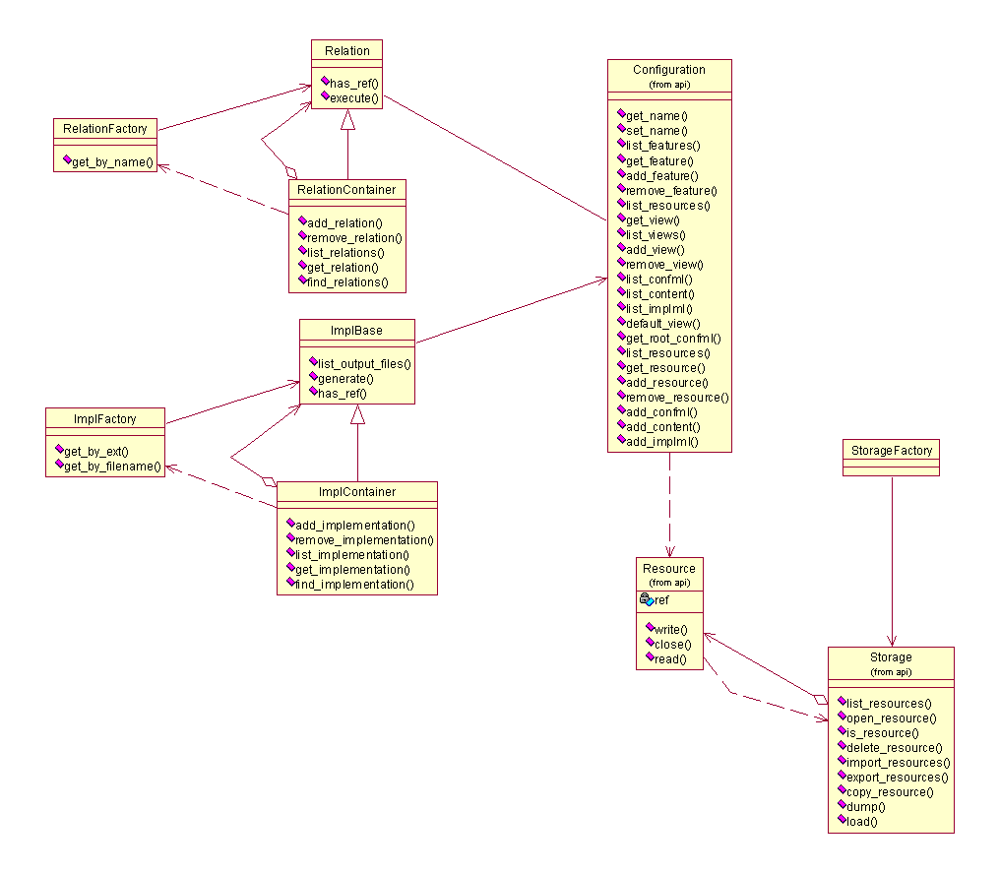

Plugin API
===============

.. module:: cone.public.plugin
   :platform: Unix, Windows
   :synopsis: Configuration interface.
.. moduleauthor:: Teemu Rytkonen <teemu.rytkonen@nokia.com>

The Plugin api is intended for extending the ConE functionality with plugins that can be for example 
implementation or relation plugins. See :ref:`plugin-howto`

Classes
-------

.. class:: ImplBase(ref, configuration)

The ImplBase class is intended for deriving any implementation plugin in ConE. A single ImplBase 
instance is created by ConE for each implml file inside a given Configuration. 

See :ref:`plugin-howto`
 
    .. method:: list_output_files()
  
    The list_output_files should return a list of output files with path, with the current configuration.
    This mechanism should enable listing of all output files before without actually generating them.

    .. method:: generate()
  
    The plugin instance is supposed to generate its output with the call of generate(). 

    .. method:: has_ref(refs)
  
    This method receives a list as an attribute and is supposed to return True|False. True if this 
    particular plugin instance has a reference to a Feature inside the given refs list. Otherwise False. 

.. class:: ImplSet

The ImplSet is a sets.Set object for a set of ImplBase instances. The main purpose of ImplSet 
is to allow operations to a set of ImplBase instances, such as generate, filter, etc. 

.. class:: ImplFactory

ImplFactory is a constructor class for the plugin instances.

    .. method:: get_impl_by_ext(cls, ext)
  
    Get the class name by file extension. 
    

    .. method:: get_impl_by_filename(cls, ref, configuration)

    Get the class name by filename.

.. class:: Relation(left, right)

    .. method:: execute()
  
    Executes the rule initiated for this Relation.

	Relation is a base class for all Relation implementations. The purpose of a Relation instance is to offer a verb or an 
	action that can be used in a rule. A rule in this context means a textual relation between two or more :class:`Feature`'s.
	For example a Depends class could be used to define dependencies between two :class:`Feature`
  
	::
	
		example rule
	  	A depends B
	
	Where A and B are :class:`Feature` references.

.. class:: RelationContainer
	
	RelationContainer is a container object that derives Relation interface, but is meant for storing a set of :class:`Relation`
	objects. It can be used to execute a set of rules read to the container.

.. class:: RelationFactory

    .. method:: get_by_name(name)
  
    returns a :class:`Relation` if the class that matches the name is found. 

	The RelationFactory is intended to be used when the rules are read from some persistent storage. When a rule is found from 
	:class:`Configuration` ConE will try to create a :class:`Relation` instance of the rule, by trying to get class 
	by :meth:`RelationFactory.get_by_name` and create an instance of that class.
	

