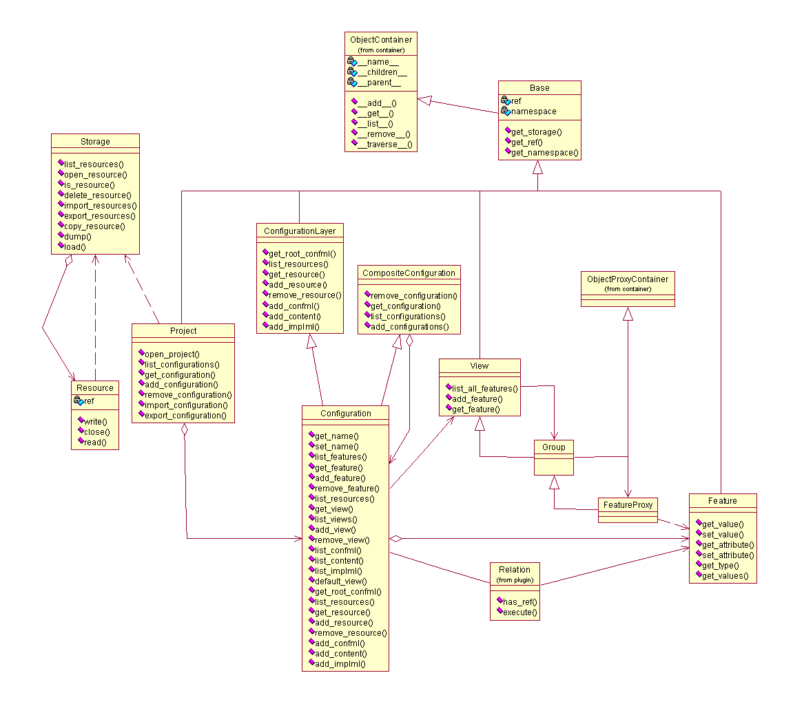

Public API
**********
Cone public API is the main interface of Cone.

.. module:: cone.public.api
   :platform: Unix, Windows
   :synopsis: Configuration interface.
.. moduleauthor:: Teemu Rytkonen <teemu.rytkonen@nokia.com>

Classes
-------
.. class:: ObjectContainer

	ObjectContainer is a base class for all Configuration related elements. It is container class for a tree structure, 
	where it can contain other ObjectContainer objects. So basically you can create B-tree type of hiararchy with it. 
	
	The main functionality of ObjectContainer is that **all children of an object container are accessible as members** 
	of the container.
	
	.. _example_member_access:
	
	Example of ObjectContainer member access:
	
	``objcontainer.configuration.get_name()``
	

	.. method:: _add(child)
	
	Add a ObjectContainer instance to this object. Checks with internal function :meth:`__supported_type__` if the given 
	child is a supported class for this object.
	
	.. method:: _add_to_path(path,child)
	
	Add a ObjectContainer instance to a specific node under this object. It creates any missing nodes between this object 
	and the path. For example __add_to_path__("foo.fii", obj), would create two nodes (foo and under it fii) if they are 
	missing (Uses internal :meth:`__default_class__` to retrieve the class which is created in this case). 
	
	.. method:: _remove(path)
	
	Remove a child from given path.
	
	.. method:: _get(path)
	
	get a child from given path.
	
	.. method:: _list()
	
	Get a list of names of immediate children of this ObjectContainer instance.
	
	.. method:: _objects()
	
	Get a list of immediate children objects of this ObjectContainer instance.
	
	.. method:: _traverse(filters)
	
	Get a list of children objects of this ObjectContainer instance, by filtering them with filters. This will cause a 
	recursive _traverse method call to all children of the ObjectContainer.
	
	.. method:: _path(toparent=None)
	
	Return the path to this object up to the toparent object. When toparent=None this will 
	return a full path to the object in the ObjectContainer hierarhcy.
	
	.. method:: _supported_type(obj)
	
	A method that is supposed to be overridden by the deriving classed if they need to change, which classes can be added 
	under each class. 
	Return True if the type of the obj is supported.
	
	.. method:: _default_class(obj)
	
	A method that is supposed to be overridden by the deriving classed if they need to change, what class is 
	the default class that is created with __add_to_path__ when objects are missing.
	Return a class.

  
.. class:: Base

	Base class for all :class:`~cone.public.api.Configuration` and its child objects. 
  
	.. method:: get_ref()
	
	return the ref of this object.
	
	.. method:: get_namepace()
	
	return the namespace of this object.
	
.. class:: Project

	Project is a container for Configuration's.

.. class:: Configuration
  
	ConE Configuration is the main interface for all configuration related activities. It is the main interface of ConE 
	itself as ConE is eventually a python interface to a configuration project. 
	 
Configuration as a Container
^^^^^^^^^^^^^^^^^^^^^^^^^^^^
	    
	The Configuration instance itself in ConE is actually just a container for a bunch of different elements. These elements can practically be any elements that exist in a 
	Configuration Project. 
	
	* :class:`~cone.public.api.Configuration` 
	* :class:`~cone.public.api.View`
	* :class:`~cone.public.api.Feature` 
	* :class:`~cone.public.api.Resource` 
	* :class:`~cone.public.plugin.Relation` 
	* :class:`~cone.public.api.Data` 
  
.. class:: Feature
	    
	Feature element is the base class for any Configurable item in a Configuration Project.

.. class:: View

	A :class:`~cone.public.api.Configuration` can contain one or more View elements, which basically can define different type of tree structure of Feature elements that exist in the Configuration.
	A View element can contain :class:`~cone.public.api.Group` and :class:`FeaturePoxy` elements.

.. class:: Group

	Group element can be child element of a :class:`~View`. It can include other Groups and :class:`~FeaturePoxy` elements to define a View hierarhcy.

.. class:: FeatureProxy
    
	FeatureProxy element is a linking object inside View that has its own ref, name, etc but it basically just 
	points to an actual :class:`Feature` instance.

.. class:: Data

	Data element defines a data value for a :class:`Feature` element. The Data elements can be defined in a 
	:class:`Configuration` and single configurable :class:`Feature` can have multiple data definitions, in different 
	configurations. The new definition always overrides the previous one. However the entire data definition hierarchy 
	is stored and is available from the Cone API.
	
.. class:: Storage

	Storage offers platform and persistence independent interface to store :class:`Resource` elements (data files, 
	configuration files, etc).

.. class:: Resource
	
	Resource is an instance of single storable element. Basically on normal filesystem this would be same as one file.
	
