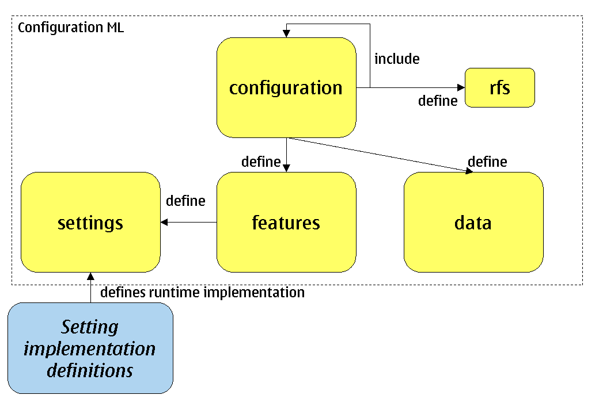
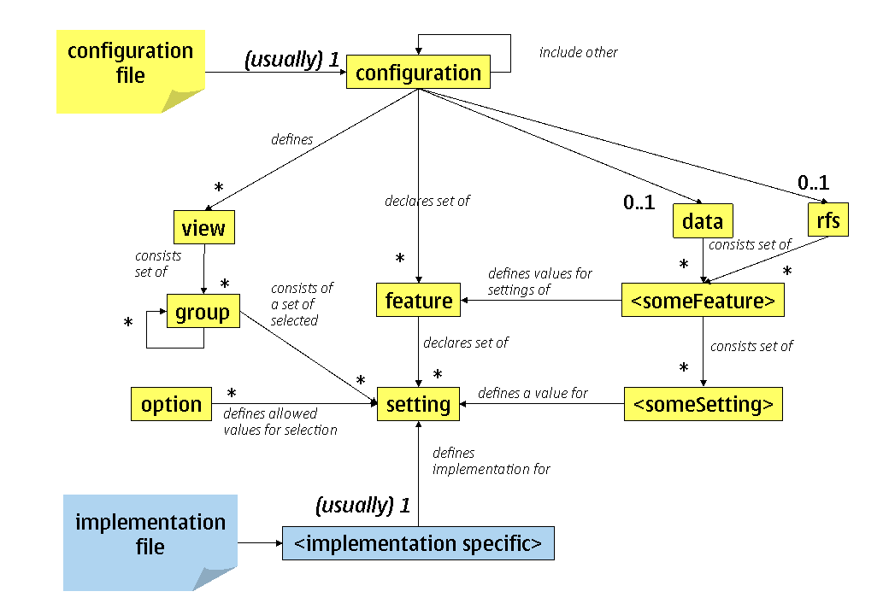
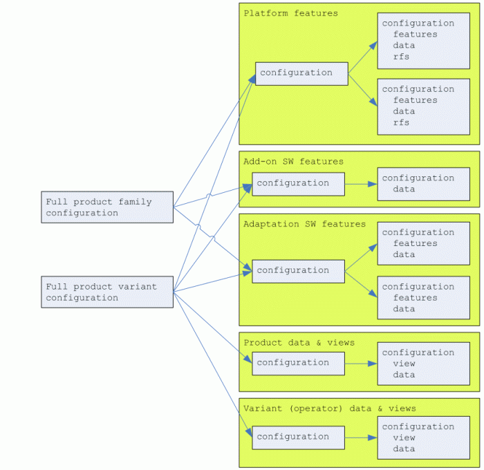
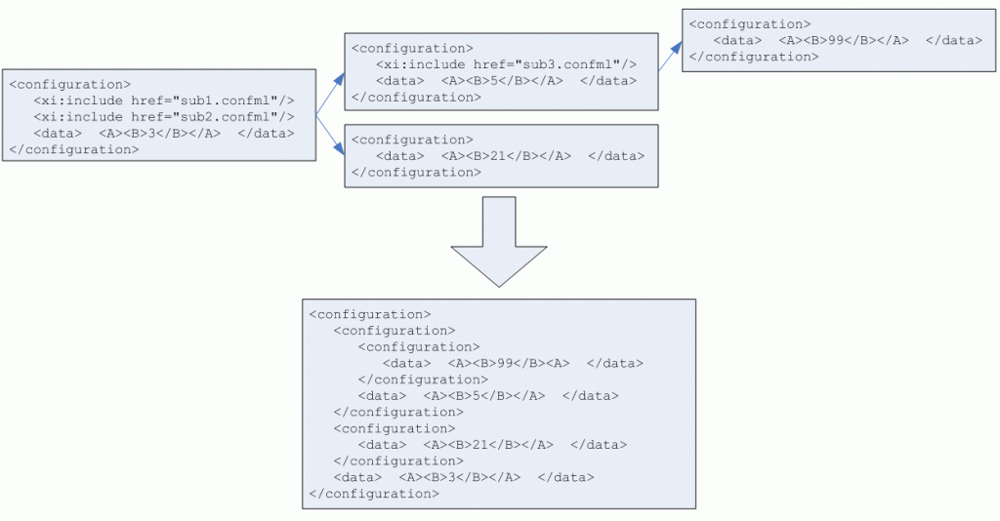
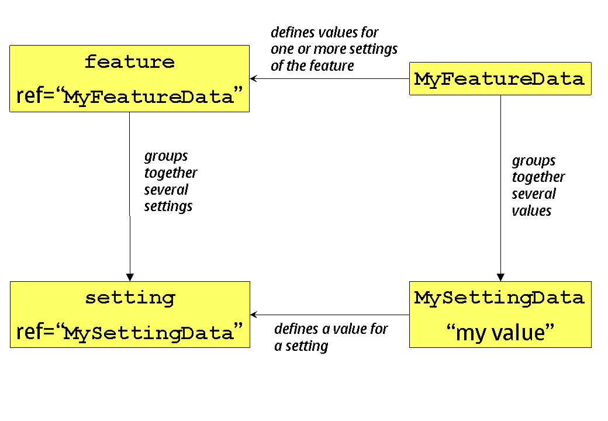

#######################################
Configuration ML Specification Document
#######################################

**Copyright (c) 2009 Nokia Corporation and/or its subsidiary(-ies).** All rights reserved. This component and the accompanying materials are made available under the terms of "Eclipse Public License v1.0" which accompanies this distribution, and is available at the URL "http://www.eclipse.org/legal/epl-v10.html".

==================
Table of contents:
==================

.. contents::

===================
1. Document Control
===================

1.1 References
--------------

#. Customization tool interoperability Requirements Specification
   http://www8.connecting.nokia.com/nmp/msw/tsw/series60/series60dm.nsf/WebAllByID/XXXJ16313-EN
#. XML Inclusions (XInclude) Version 1.0, W3C Recommendation, 20 December 2004
   http://www.w3.org/TR/xinclude/
#. Extensible Markup Language (XML) 1.0 (Third Edition), W3C Recommendation,
   http://www.w3.org/TR/2004/REC-xml-20040204
#. Modularization of XHTML, W3C Recommendation
   http://www.w3.org/TR/2001/REC-xhtml-modularization-20010410
#. XML Linking Language (XLink) Version 1.0, W3C Recommendation, 27 June 2001
   http://www.w3.org/TR/xlink/
#. XML Path Language (XPath) Version 1.0, W3C Recommendation, 16 November 1999
   http://www.w3.org/TR/xpath
#. XML Schema Part 2: Datatypes Second Edition, W3C Recommendation, 28 October 2004
   http://www.w3.org/TR/xmlschema-2/
#. XHTML(TM) 2.0 - W3C Working Draft 22 July 2004
   http://www.w3.org/TR/xhtml2/
#. Extending and Versioning XML Languages with XML Schema
   http://www.pacificspirit.com/Authoring/Compatibility/ExtendingAndVersioningXMLLanguages.html
#. 
#. RELAX NG Specification, OASIS Committee Specification, 3 December 2001
   http://www.relaxng.org/spec-20011203.html
#. Uniform Resource Identifiers (URI): Generic Syntax, August 1998
   http://www.ietf.org/rfc/rfc2396.txt
#. S60 Customization Tool
   http://s60wiki.nokia.com/S60Wiki/S60_Customization_Tool

1.2 Glossary
------------

.. glossary::

   Central Repository
      `Symbian OS <http://s60wiki.nokia.com/S60Wiki/Symbian_OS>`_ service that provides a user interface to allow one or more clients to open repositories, and to provision and retrieve information from those repositories.
   Configuration
      Specific values for a collection of settings. Used to configure terminal SW for certain platform release, product or trade customer (for example operator). In Configuration ML the root element of the language and includes also feature and setting definitions.
   Configuration element
      Defines a `configuration <http://s60wiki.nokia.com/S60Wiki/S60_Terminal_SW_Configuration>`_  capability of software. Is used to define using one or more settings or features.
   Configuration enabler
      A software functionality that at runtime implements configurability for one or more setting
   Configuration Tool
      Tool used for configuring SW build (for example variant)
   ConfML
      Configuration Markup Language, language defined in this document
   Customization Tool
      S60 specific tool to configuring SW build (for example variant). Replaced by Configuration Tool. 
   Extension policy
      A mechanism for controlling how sequence item-settings for single setting in multiple configurations are handled.
   Feature
      A collection of related settings.
   Group
      For structuring settings in view.
   Item-setting
      A single item in a data of a sequence setting. Each item-setting defines values for sub-settings. For example, every contact in a data for phone book setting is an item-setting.
   lowerCamelCase
      Practice of writing `compound words <http://en.wikipedia.org/wiki/Compound_noun_and_adjective>`_ or phrases in which the words are joined without `spaces <http://en.wikipedia.org/wiki/Whitespace_%28computer_science%29>`_ and are `capitalized <http://en.wikipedia.org/wiki/Capitalization>`_ with the exception of the first word within the compound (http://en.wikipedia.org/wiki/CamelCase).
   Option
      Allowed value for a setting.
   Restore Factory Settings (RFS)
      Feature for reinitialising device data to factory settings stored on ROM.
   Setting
      Defines a single configurable element (for example mailbox name).
   Setting implementation
      Information about platform specific implementation. Used when building a configuration. Specific for the used configuration enabler
   Sub-configuration
      A configuration included in other configuration.
   Sub-setting
      Individual setting data elements that are available for each item-setting of a sequence data. For example, phone number field of every contact item-setting is a sub-setting.
   Value
      Defines a value of a setting. Single customizable value of a certain setting. For example Mailbox name.
   Variant 
      A specific kind of configuration. Term used in Customization Tool for customer specific values.
   View
      For rearranging settings into new structure and redefining their properties regardless how they where defined originally.

===============
2. Introduction
===============

2.1 Purpose and scope
---------------------

Configuration ML (later in document 'Configuration ML' or 'ConfML') is a XML-based markup language (that is, an XML application) for defining SW configuration elements and configuration data of SW product. 

Configuration ML is an evolution of XML language designed and used for S60 Customization Tool. Full compatibility with the tools already supporting so-called variant data files of earlier format was first seen as important. However, it was afterwards seen that compatibility would only make Configuration ML more complicated than needed. Also new features of such as mapping Boolean settings to bitmasks key in Central Repository and enabling incremental definition of sequences would have not been supported by old format. Therefore The Configuration ML is not compatible with variant features or variant data XML formats used by S60 Customization Tool. On the other hand it is possible to develop tools that support reading and/or writing both formats. Configuration ML language itself is not S60 specific and therefore can be used also outside S60.

2.2 Main concepts
-----------------

The Configuration ML consists of four plus one main components as shown in Figure 1.

Figure 1 The main components of Configuration ML

Configuration ML is primarily used to define configurations, features, settings, and data. The fourth component is Restore Factory Settings component, rfs. All these components are optional. Configuration is the top level concept of the language. It groups together relevant configuration features and values for them. Features consist of settings. Configurations are typically defined incrementally, and therefore configuration can be defined by means of any number of other configurations. Chapter 3 explains in detail the main concepts of the language.

Setting implementation definitions are defined using separate languages, which are defined in separate documents. One of the main goals of Configuration ML is to separate the logical feature definitions from the actual implementation specific details. Setting implementation definitions contain all the required logic to convert values in data part to implementation specific values that are used either at ROM image creation time or by the terminal software at runtime.

2.3 Applicability
-----------------

This specification defines how Configuration ML can be used to define all SW related configurability aspects of a software system. 

Configuration ML is most typically used for those local or global functionality and user experience related configuration elements that are used for localization, differentiation and customization purposes.

When defining configuration elements in using Configuration ML suitable abstraction level should be selected. In complex cases it might be better to use for example domain specific language and external file to describe the fine details, and only then have selection of an external file as a setting in Configuration ML. This approach also enables to build dedicated (possible graphical) tools to define the internal details of the element.

2.4 Namespace
-------------

All the elements of Configuration ML are defined in a single versioned namespace called http://www.s60.com/xml/confml/2 . The namespace is updated for major, possibly non-backward compatible versions only. New minor versions must maintain compatibility. The root element of the document, configuration, must contain an xmlns declaration for this namespace. None of the attributes in this specification belong to any namespaces and therefore are never prefixed.  

Example::

  <configuration xmlns="http://www.s60.com/xml/confml/2" />

When elements of Configuration ML are stored in a separately included file, namespace needs to be redefined. Refer to chapter 3.2.3 for more information on how to use multiple files to define a configuration.

The setting implementation information is defined in implementation specific namespace.  

The namespace of Configuration ML must not be used for any other elements than defined in this document. All extensions must be therefore defined in some other namespace.

2.5 MIME types and file name extensions
---------------------------------------

The MIME type for XML files of Configuration ML is 'text/application+xml'. 

It is recommended that all Configuration ML files use file name extension '.confml' (all lowercase) on all platforms.

The file name extensions of setting implementation XML files are implementation specific.

2.6 Reuse and Extensibility
---------------------------

Configuration ML relies heavily on other existing XML language. Following XML languages are used one way or another: XPATH [6], XInclude [2], and XML schema [7].

XPath is a language for addressing parts of an XML document. In support of this primary purpose, it also provides basic facilities for manipulation of strings, numbers, and Booleans. XPath uses a compact, non-XML syntax to facilitate use of XPath within URIs and XML attribute values. XPath operates on the abstract, logical structure of an XML document, rather than its surface syntax. Refer to chapter 3.4 and 3.3.2 for more information on XPath expressions are used in configuration ML.

XInclude is a standard for assembling XML instances into another XML document through inclusion. It enables larger documents to be dynamically created from smaller XML documents without having to physically duplicate the content of the smaller files in the main file. Refer to chapter 3.2.3 for more information on working with multiple files.

Configuration ML itself is designed to be extensible meaning that it can be further developed by defining new elements in own namespace.  

2.7 Validation and usage
------------------------

This document is the official definition for the Configuration ML XML language.

All Configuration ML documents must be valid XML 1.0 documents. The applications and tools supporting Configuration ML are assumed to check the well-formedness of the Configuration ML document instances.  

Every Configuration ML document should have XML declaration with version as the first thing in the file. 

The root element of every Configuration ML document must be configuration. The version attribute for this element must be specified as '1.0'.

Example::

  <?xml version="1.0"?>
    <configuration xmlns="http://www.s60.com/xml/confml/2" version="1.0">
    <!-- the body of the document -->
    </configuration>

2.8 Localization
----------------

As all XML documents, Configuration ML supports both UTF-8 and UTF-16 encodings. It is recommended to declare used encoding with XML declaration. This declaration is mandatory when other encoding than UTF-8 or UTF-16 is used. By default, UTF-8 encoding should be used, in case there is no good reason to do otherwise.  

Example::

  <?xml version="1.0" encoding="UTF-8"?>
  <!-- the rest of the document ->

Any characters from Unicode character set can be written in XML using XML Numerical Character Reference syntax: &#<decimal_character_code>; or &#x<hex_character_code>; .  

======================================================
3. Overview
======================================================

3.1 Components of Configuration ML
----------------------------------

Figure 2 depicts the main elements of Configuration ML language and how they map to implementation elements.

Figure 2 The main elements of Configuration ML

The elements shown in yellow are part of the Configuration ML. The elements shown in blue are implementation specific elements. For most of the Configuration ML elements shown in the Figure 2 there is a corresponding XML element. Those elements are defined in chapter 6. The elements named inside brackets represent either feature or setting specific XML elements as explained in chapter 3.4. The cardinalities of the elements are shown next to the connecting lines. The proximity of the cardinality marking defines the reading direction, for example "configuration can have any number of features".

3.2 Configuration
-----------------

Configuration is the top level concept in Configuration ML. Configuration has three main roles:

1. Defines configuration elements in terms of features and settings (chapter 3.3)
2. Defines views for visually rearranging settings (chapter 3.5)
3. Defines data (values) for settings (chapter 3.4)

Any configuration can have all the above rules or just one of them. Configuration can also just contain other configurations as explained in chapter 3.2.2.

3.2.1 Release specificity
^^^^^^^^^^^^^^^^^^^^^^^^^

Configuration ML is agnostic to versioning of software. Managing multiple versions of software component(s) that have varying configurability capabilities will typically require multiple (independent) Configuration ML documents. Release element of meta element can be used to identify the release of a software component, platform or product in question if required.

3.2.2 Hierarchical configurations
^^^^^^^^^^^^^^^^^^^^^^^^^^^^^^^^^

Configurations are not typically defined in isolation, but they are parts of other configurations. To support this configuration can contain any number of other configurations (also called 'sub-configurations') as shown in the Figure 2. This enables features (including their settings), views, and data of a configuration to be defined using other configurations, which all can also be used independently of the including configurations when needed. The containment hierarchy of configurations would typically follow software or product architecture, or/and organisation developing the software or product.

For example when defined according to software architecture of a terminal product, there would be a 'master' configuration for the product itself that could include configurations of manufacturer specific platforms. These platform configurations could itself consist of configurations defining each architecture domain and eventually each subsystem and component in the platform. Each of these component configurations could define the relevant features, settings, and default values, while including configurations typically refine the values further.  

Each of the configurations can be created and used independently, in case they contain all the required includes so that referred setting definitions can be found. In addition they might override some or all the default values of the settings defined in included configurations.

Please note that only data (that is, setting values) of the contained configurations can be overridden but not views, features, or settings.

As a special case data of sequential settings can also be defined incrementally. In this case configuration extends (as a contrary to overriding) data of a setting that is defined in any of the included sub-configurations.

3.2.3 Structuring configurations to files
^^^^^^^^^^^^^^^^^^^^^^^^^^^^^^^^^^^^^^^^^

Typically features need to created and maintained by several persons/organisation and therefore storing all feature definitions into one file would cause problems. The definitions of a configuration can be split to any number of XML files by using include elements of XInclude specification [2]. Therefore it is possible to have each of the sub-configurations in own files. The only constraints are that every included file itself must be a complete valid Configuration ML XML document (that is, with configuration as the root element). When using multiple Configuration ML files it is also important to make sure that every feature and setting is defined only once. Refining features or setting is not allowed except when using view definitions (see chapter 3.5).

When under single root configuration there exists multiple configurations with each own values, the priority of the values depends on the order: values later in XML document tree traversal order overrides any earlier values.

An example hierarchy of files is shown in Figure 3.

Figure 3 An example hierarchy of configuration files

In the example, there is two full configurations, one for product family and other for product variant (customised by operator). These configuration are composed by using includes. In a way, product family configuration is a subset of product variant configuration, and thus product variant could also include product family configuration and refine it further with product and variant specific definitions. However having each of the stakeholder represented as an a independent configuration, allows composing any kind of configuration more freely (e.g. free ordering, selecting only a subset). The order of inclusions defines also the override order, effectively acting as a method to define the inheritance order of configurations.

Only a subset of XInclude specification is required[1] to be supported with Configuration ML. First of all, support for inclusion of local resources with relative URI is required. All included resources are to be parsed as xml and therefore parse attribute is not required. Also, support for xi:fallback element is not required. Refer to chapter 4.5 for complete list of supported attributes of xi:include element.

.. [1] "Required" means here that some tools might choose to support more that what is required by this specification but must not assume the same from other tools.

3.3 Features and settings
-------------------------

3.3.1 Defining features and settings
^^^^^^^^^^^^^^^^^^^^^^^^^^^^^^^^^^^^

Each configuration defines zero or more configuration elements in terms of features and settings. A feature groups together related settings. One setting describes a certain configuration capability implemented in software. Every feature must be identified uniquely using ref attribute. Each feature must be unique and defined only once in configuration including any sub-configurations included in it. In the same way every setting must be uniquely identified inside a feature. Once feature or setting is defined, it cannot be anymore redefined or extended elsewhere in the configuration.  

3.3.2 Linking implementation to settings
----------------------------------------

Implementations of settings are defined in a separate file(s) as already shown in Figure 2. No implementation is defined on feature level but every setting can and should have its own implementation. Relative XPATH location path definitions are used to link the setting implementations to the settings. To create a location path that is unique in the configuration the ref path of the feature and setting is concatenated together.

3.4 Data
--------

3.4.1 Defining values
^^^^^^^^^^^^^^^^^^^^^

One of the main roles of configuration is to define values for settings. Values can be defined only for settings that have been declared in the configuration (including any sub-configurations). Although there can be only one data element containing the values in a configuration, all sub-configuration can also contain own data elements and therefore also values.

When values can be defined for settings in multiple places inside a configuration, it is important to understand the priority rules for interpreting them. One of the main use cases of Configuration ML is to allow overriding values of settings that were already defined in the included configuration. This is accomplished by utilizing normal xinclude expansion rules. In principle, include statements found from a configuration are expanded so that included document becomes a part of the including document. Prioritization of overrides is done by ordering the inclusions properly in the configuration.

Figure 4 shows example configuration hierarchy on top, and the processed (expanded) version on the bottom. In this example, value 3 is applied to setting A/B.

Figure 4 Priority of values

As a special case, data of sequential settings can also be defined incrementally. In this case configuration can optionally extend (as a contrary to overriding) data of a setting that is defined in any of the included sub-configurations. This behaviour is controlled using extension policy of the setting data element (chapter 6.9). The extension can either append the new data to the end of existing data or prefix the existing data. If every configuration in the Figure 4 would contain value with append policy, then the actual data of that setting would be constructed in order of inclusions; first item(s) would be used from sub3.confml and the last items from the main configuration.

Most of the settings defined in configurations are meant to be configured on product or customer level. In order to allow defining the value of read-only attribute, values defined for settings that are defined directly in the same configuration do not need to obey read-onlyness statement of setting. Essentially this means that read-only settings can be modified locally in the defining configuration (which is usually in the same file as the setting definition), in other configurations (usually in other files) it is locked for modifications.

A configuration can directly define value at most only once of each setting.

3.4.2 Linking settings and values
---------------------------------

Values of a configuration are defined using element. Values can be defined for zero or more settings. Relative XPATH[6] paths are used to link values to settings on two levels: first on feature level and then on a setting level. See Figure 5 for illustration of how ref attributes are used.

Figure 5 Linking settings and values

Elements under data elements that do not match to any setting should be preserved during all processing but can be excluded from validation.

3.5 Views
---------

View definitions in configurations can be used to visually  rearrange selected features and settings into new structure regardless how they where defined originally. By default settings are clustered according to features they are defined in but with views this can be overridden by use of group elements. Support for hierarchical groups is not limited.

Any number of views can be defined in a configuration (including its sub-configurations) and it is up to tool or user of the tool to choose the active view if and when needed. Views are useful for creating for example terminal product specific views that show only the relevant settings and hide all the others. In addition to grouping selected features and settings, additional setting and option definitions can also be defined. This can be used for example to provide additional documentation for the user or to allow only restricted set of values to be defined. These additional definitions must never change the original meaning of the settings but can only restrict valid values even further from what was defined in the original setting definition. Therefore set of valid values according to the view must be a subset of valid values, as defined by the original setting definition. When validating data it is possible to use these additional restrictions in the active views also. As an example, if setting was originally defined to accept only values from 3 to 100, a view can add additional constraint that only allows odd numbers between 50 and 100. However, it would be illegal for view to define range from 2 to 110.

It is important to note that view only affects how the features, settings, and values are visualized and optionally validated. The view must not have any effect to meaning (including type and data reference) of it or existence of data, when using data for example for building a configuration. Therefore all constraints and dependencies in original setting definitions apply whether or not the features and/or settings are part of the active view.

================================
4. Common definition conventions
================================

This document defines Configuration ML language and its semantics. This section describes the conventions used in Configuration ML. These conventions are based on [4].

4.1 Structure
-------------

The language definition is structured in the following way:

- An abstract definition of the elements, attributes, and content models, as appropriate.
- A sub-section for each element; These sub-sections contain the following components:

 - A brief description of the element,
 - A definition of each attribute or attribute collection usable with the element, and
 - A detailed description of the behaviour of the element, if appropriate.

Examples are provided with most of the definitions. Please note that they typically only show the element and attribute relevant for the definition in question, and therefore should not be taken as complete Configuration ML examples. More complete examples are provided in implementation markup language specifications.

4.2 Syntactic Conventions
-------------------------

.. list-table::

   - - expr ?
     - Zero or one instances of expr are permitted.
   - - expr +
     - One or more instances of expr are required.
   - - expr *
     - Zero or more instances of expr are permitted.
   - - a ; b
     - Expression a and b are required in no specific order.
   - - a , b
     - Expression a is required, followed by expression b.
   - - a | b
     - Either expression a or expression b is required.
   - - a - b
     - Expression a is permitted, omitting elements in expression b.
   - - parentheses
     - n is contained within parentheses, evaluation of any sub-expressions within the parentheses take place before evaluation of expressions outside of the parentheses (starting at the deepest level of nesting first).
   - - defining required attributes
     - When an element requires the definition of an attribute, that attribute name is followed by an asterisk (*).
   - - defining the type of attribute values
     - When a module defines the type of an attribute value, it does so by listing the type in parentheses after the attribute name.
   - - defining the legal values of attributes
     - When the legal values are defined for an attribute, it does so by listing the explicit legal values (enclosed in quotation marks), separated by vertical bars (|), inside of parentheses following the attribute name. If the attribute has a default value, that value is followed by an asterisk (*). If the attribute has a fixed value, the attribute name is followed by an equals sign (=) and the fixed value enclosed in quotation marks.

4.3 Content Types
-----------------

Minimal, atomic content models are defined for each element. These minimal content models reference the elements in the language itself. They may also reference elements in other languages upon which the language depends. Finally, the content model in some cases requires that text be permitted as content to one or more elements. In these cases, the symbol used for text is PCDATA[3]. This is a term refers to processed character data. Content type can also be ANY, meaning that any elements can be supported. A content type can also be defined as EMPTY, meaning the element has no content in its minimal content model.

4.4 Attribute Types
-------------------

Following table lists definitions for all used XML attribute types. 

.. list-table::

   - - Attribute Types
     - Definition
   - - CDATA
     - Character data [3]
   - - IDREF
     - A reference to a document-unique identifier [3]
   - - NMTOKEN
     - A name composed of only name tokens as defined in XML 1.0 [3]. All leading and trailing whitespace is removed but no whitespace is allowed within the value itself.
   - - NMTOKENS
     - A whitespace separated list of NMTOKENs.
   - - NUMBER
     - Sequence consisting only digits ([0-9]) [3]
   - - URI
     - A Uniform Resource Identifier [12].
   - - XPATH (path)
     - An XPATH [6] location path. Support for only relative element location paths defined in abbreviated syntax is required. Only subset of XPATH language is supported; refer to examples for details.
   - - 
     - 
   - - xs:token
     - Whitespace-replaced and collapsed strings as defined in XML Schema [7]. In addition to removing all leading and trailing whitespace, also all consecutive spaces, carriage returns, linefeeds and tabs within the value itself are replaced by a single space.

4.5 Naming conventions
----------------------

Element, attribute, and type names are composed of words in the English language, using the British English spellings.

Lower Camel Case (LCC) is used for naming attributes, elements, and types. Lower Camel Case capitalizes the first character of each word except the first word and compounds the name.

=====================
5. Common definitions
=====================

This chapter contains common attribute and element definitions used by elements in Configuration ML and setting implementation languages.

.. list-table::

   - - Elements
     - Attributes
     - Content Model
   - - `elements supporting CommonAttrs <#_Common_attributes_(CommonAttrs)>`_
     - id (NMTOKEN)
     - N/A
   - - `meta <#_Meta_elements>`_
     - CommonAttrs
     - id?; date?; owner?; editor?; status?; version?; platform?; product?; release?; customer?; origin?; target?; desc?; icon?; link*
   - - `desc <#_The_desc_element>`_
     - CommonAttrs, xl:href (URI), xl:title (CDATA)
     - PCDATA
   - - `icon <#_The_icon_element>`_
     - CommonAttrs, xl:href* (URI), xl:title (CDATA)
     - EMPTY
   - - `link <#_The_link_element>`_
     - CommonAttrs, xl:href* (URI), xl:title (CDATA)
     - EMPTY
   - - xi:include
     - CommonAttrs, href* (URI)
     - EMPTY

Elements starting with xi namespace prefix are defined in XInclude[2]. Only listed attributes are supported for those elements. The rest of the elements are defined in the following sections.

5.1 Common attributes (CommonAttrs)
-----------------------------------

The CommonAttrs attribute collection defines common attributes used by all Configuration ML elements. These attributes don't belong to any namespace and therefore must not be prefixed. These attributes are optional always.

.. list-table::

   - - Attributes name
     - Type
     - Default
     - Description
   - - id
     - NMTOKEN
     - not defined
     -  The identifier of an element. Not used within language for identification. If defined ) the id of an element must be unique within the user interface definition. Typically descriptive ids that describe the purpose of the element should be used.

Example::

  <feature id="myfeatureid">
   <setting id="thesetting"/>
  </feature>

5.2 Meta elements
-----------------

The meta elements define common metadata for certain elements in configuration and setting implementation documents. The meta element is the parent for all other meta elements. Typically meta element is the first child of the root element. None of the meta elements have any attributes but all the content is defined as PCDATA.

In addition to common elements the following meta specific elements are defined in this specification.

.. list-table::

   - - Elements
     - Attributes
     - Content Model
   - - id
     - CommonAttrs
     - PCDATA
   - - date
     - CommonAttrs
     - PCDATA in the format CCYY-MM-DD\[z\|\(-\|+\)hh\:mm\]
   - - owner
     - CommonAttrs
     - PCDATA
   - - editor
     - CommonAttrs
     - PCDATA
   - - status
     - CommonAttrs
     - PCDATA
   - - version
     - CommonAttrs
     - PCDATA
   - - platform
     - CommonAttrs
     - PCDATA
   - - product
     - CommonAttrs
     - PCDATA
   - - release
     - CommonAttrs
     - PCDATA
   - - customer
     - CommonAttrs
     - PCDATA
   - - origin
     - CommonAttrs
     - PCDATA
   - - target
     - CommonAttrs
     - PCDATA

The date is defined according to data type 'date' of XML Schema [7]. UTC time zone can be defined with letter Z at the end of the date string. Other time zones are represented by their difference from UTC in the format +hh:mm or -hh:mm. If no time zone is defined then it is undefined. Meta element can be extended by defining new child elements in a separate namespace.

Example::

  <configuration>
   <meta>
    <date>2006-06-19</date>
    <owner>John Smith</owner>
    <editor>John smith Junior</editor>
    <status>draft</status>
    <platform>S60</platform>
    <product>N99</product>
    <release>3.9</release>
    <desc>Reference configuration</desc>
    <customer>MegaOperator</customer>
   </meta>
  </configuration>

5.3 The desc element
--------------------

The desc element can be used for description or documentation for any element. The data can be defined either as the content of the element or using xl:href attribute.

.. list-table::

   - - Attributes name
     - Type
     - Default
     - Description
   - - CommonAttrs
     - 
     - 
     - Common attribute definitions defined in Common definitions
   - - xl:href
     - URI
     - not defined
     - Used to define the location of external description or documentation.
       From XLink [5].  
   - - xl:title
     - CDATA
     - not defined
     - Used to define title for the link defined using xl:href.
       From XLink [5].

Example::

  <group id="cameragroup">
   <desc xl:href="file:howtoconfigurecamera.html" xl:title="Help"/>
  </group>
  <group id="someothergroup">
   <desc>Configure the camera</desc> 
  </group>

5.4 The icon element
--------------------

The icon element can be used to define graphical icon for an element.

.. list-table::

   - - Attributes name
     - Type
     - Default
     - Description
   - - CommonAttrs
     - 
     - 
     - Common attribute definitions defined in Common definitions
   - - xl:href*
     - URI
     - not defined
     - Used to define the location of the icon.
       From XLink [5].  
   - - xl:title
     - CDATA
     - not defined
     - Used to define title for the link defined using xl:href.
       From XLink [5].

Example::

  <group id="cameragroup">
   <icon xl:href="file:camera.svg" xl:title="icon"/>
  </group>

5.5 The link element
--------------------

The link element can be used to locate any external resource.

.. list-table::

   - - Attributes name
     - Type
     - Default
     - Description
   - - CommonAttrs
     - 
     - 
     - Common attribute definitions defined in Common definitions
   - - xl:href*
     - URI
     - not defined
     - Used to define the location of the resource.
       From XLink [5].  
   - - xl:title
     - CDATA
     - not defined
     - Used to define title for the link defined using xl:href.
       From XLink [5].

Example::

  <group id="cameragroup">
   <link xl:href="http://coolcameras.html" xl:title="camera shop"/>
  </group>

===================
6. Configuration
===================

The Configuration ML is used define the configuration elements and values for them. The root element of the document is configuration element.

The elements and attributes included in this module are:

.. list-table::

   - - Elements
     - Attributes
     - Content Model
   - - configuration
     - CommonAttrs, xmlns (URI = " http://www.s60.com/xml/confml/2"), version (NMTOKEN = "1.0"), name (xs:token)
     - meta?; desc*; icon*; link*; xi:include*; feature*; view*; configuration*; data?; rfs?
   - - `feature <#_The_header_element>`_
     - CommonAttrs, name (xs:token), ref* (XPATH), relevant (xs:token)
     - desc*; icon*; link*; setting*
   - - `setting <#_The_include_element>`_
     - CommonAttrs, relevant (xs:token), required (NMTOKEN), constraint (xs:token), readOnly (NMTOKEN), name (xs:token), type* (NMTOKEN), ref* (XPATH), minOccurs (NUMBER), maxOccurs (NMTOKEN), mapKey (XPATH), mapValue (XPATH)
     -  desc*; icon*; link*; option*; setting*; xs:minInclusive?; xs:maxInclusive?; (line-break) xs:minExclusive?; xs:maxExclusive?; xs:pattern*; xs:minLength?; maxLength?; totalDigits?; property*; localPath*; targetPath*)
   - - localPath
     - CommonAttrs, constraint (xs:token), readOnly (NMTOKEN), required (NMTOKEN), map (XPATH)
     - desc*; icon*; link*
   - - targetPath
     - CommonAttrs, constraint (xs:token), readOnly (NMTOKEN), required (NMTOKEN), map (XPATH)
     - desc*; icon*; link*
   - - `option <#_The_views_element>`_
     - CommonAttrs, name* (xs:token), value* (CDATA), relevant (xs:token), map (XPATH)
     - desc*; icon*; link*
   - - `property <#_The_property_element>`_
     - CommonAttrs, name (xs:token), value (CDATA), unit (xs:token)
     - desc*; icon*; link*
   - - `view <#_The_view_element_1>`_
     - CommonAttrs, name* (xs:token)
     - meta?; desc*; icon*; link*; group*
   - - `group <#_The_group_element>`_
     - CommonAttrs, name* (xs:token)
     - group*; desc*; icon*; link*; setting*
   - - xs:minInclusive 
     - value (NUMBER)
     - EMPTY
   - - xs:maxInclusive
     - value (NUMBER)
     - EMPTY
   - - xs:minExclusive 
     - value (NUMBER)
     - EMPTY
   - - xs:maxExclusive
     - value (NUMBER)
     - EMPTY
   - - xs:pattern
     - value (xs:token)
     - EMPTY
   - - xs:length
     - value (NUMBER)
     - EMPTY
   - - xs:minLength
     - value (NUMBER)
     - EMPTY
   - - xs:maxLength
     - value (NUMBER)
     - EMPTY
   - - xs:totalDigits
     - value (NUMBER)
     - EMPTY
   - - `data <#_The_data_element>`_
     - CommonAttrs
     - ANY
   - - `rfs <#_The_rfs_element>`_
     - CommonAttrs
     - ANY

All restriction elements (known as facets) starting with xs namespace prefix are defined in XML Schema [7]. Only listed attributes are supported for those elements. The rest of the elements are defined in the following sections.

6.1 The configuration element
-----------------------------

The configuration element is the root element of Configuration ML document. Version of the used specification must be defined using version attribute.

Typically first child element under configuration is meta element. After that feature, view, and data elements follow.

.. list-table::

   - - Attributes name
     - Type
     - Default
     - Description
   - - CommonAttrs
     - 
     - 
     - Common attribute definitions defined in Common definitions.
   - - version*
     - NMTOKEN
     - not defined
     - The version of the document. This attribute is mandatory and its value must be "1.0".
   - - name
     - xs:token
     - not defined
     - Textual name of the configuration. 

Example::

  <?xml version="1.0"?>
  <configuration xmlns="http://www.s60.com/xml/confml/2" version="1.0" name="myfirstconfiguration">
   <meta/>
   <feature/>
   <data/>
   <rfs/>
  </configuration>

6.2 The feature element
-----------------------

The feature element defines one or more configuration elements in terms of settings. Feature element is used to group settings into logical collections. A configuration ML feature typically maps into a feature of a subsystem, a platform or a product.

.. list-table::

   - - Attributes name
     - Type
     - Default
     - Description
   - - CommonAttrs
     - 
     - 
     - Common attribute definitions defined in Common definitions.
   - - name
     - xs:token
     - not defined
     - Textual name of the feature.
   - - ref*
     - XPATH (path)
     - not defined
     - Uniquely identifies the feature in the configuration.
       A path to the feature specific element containing values for all the setting. The path must be defined using )relative location path in abbreviated XPATH [6] form. The path must map to at most one feature element.
       Together with ref element of a setting, the path must be relative location path to a setting specific element in abbreviated XPATH [6] form.  
       The ref attribute of the feature is also used for identifying settings inside view definitions.
       This attribute is mandatory for all features.
   - - relevant
     - xs:token
     - true
     - Defines whether the feature is used. Can be used to exclude all the settings of the feature that are not relevant in some context. Values with this property value false for the parent feature are not used.
       The grammar of expression language is defined in chapter 8.

Example::

  <feature id="f_camf_00" name="Camcorder Features" ref="CamcorderFeatures">
   <desc/>
   <setting/>
   <setting/>
  </feature>

6.3 The setting element
-----------------------

The setting element defines a single configurable setting. When used inside a view element, setting element is used to include the setting in a view, and possibly redefine any of its properties.

Sequential settings are defined using hierarchical settings definitions where setting element contains one or more setting definitions. The settings of each item in a sequence are defined using sequence elements under the setting element. The number of settings in a sequence can be limited with minOccurs and maxOccurs attributes.

.. list-table::

   - - Attributes name
     - Type
     - Default
     - Description
   - - CommonAttrs
     - 
     - 
     - Common attribute definitions defined in Common definitions.
   - - name
     - xs:token
     - ""
     - Textual name of the setting. To be used in user interfaces of tools and documentation.
   - - type*
     - NMTOKEN
     - not defined
     - Type of the element. Refer to chapter 7 for supported types. Attribute is not allowed when element is inside a view.
   - - ref*
     - XPATH (path)
     - not defined
     - Uniquely identifies the setting under the parent feature. A path to the element containing value for the setting. The path must be defined using relative location path in abbreviated XPATH [6] form. The path must map to at most one value element. The ref attribute is also used for uniquely identifying settings inside view definitions and in setting implementation. Because of this ref of a setting must be unique under the feature. This attribute is mandatory for all settings under a feature element. Attribute is not allowed when element is inside a view.
   - - constraint
     - xs:token
     - true
     - Defines any constrains for the values supported by the setting. Values with this property evaluating to false are invalid. The grammar of expression language is defined in chapter 8.
   - - relevant
     - xs:token
     - true
     - Defines whether the setting is used. Can be used to exclude settings that are not relevant in some context. Values with this property evaluating to false are not used. The grammar of expression language is defined in chapter 8.
   - - readOnly
     - NMTOKEN
     - false
     - Defines the settings as non-modifiable. Values to settings with this attribute value true are restricted from being defined outside the configuration where they where originally defined in. Therefore only the initial default values can be defined for read only settings. The supported values are true and false.
   - - required
     - NMTOKEN
     - false
     - Defines whether a value must be defined for the settings before the configuration is complete. Can be used to force user to define a value for settings that can not use any default value. Missing required value must not prevent saving configuration at any point. In case defined for a setting of type sequence, requiredness mandates having at least one item-setting defined. In case defined for a sub-setting of a sequence, requiredness is evaluated separately for each item-setting. The supported values are true and false. The use of requiredness information is tool specific. Completeness of a configuration might be required by a configuration tool in case of validation or generation of a variant. 
   - - minOccurs
     - NUMBER
     - 0
     - The minimum number of value elements allowed in case of sequence type of setting.
   - - maxOccurs
     - NMTOKEN
     - "unbounded"
     -  The maximum number of value elements allowed in case of sequence type of setting. When any number of elements are allow, value "unbounded" can be used.
   - - mapKey
     - XPATH (path)
     - not defined
     - In case setting is used as enumeration source for name-id mapping (see chapter 6.11), value of this attribute defines the key part of the enumeration. If used, setting's type must be sequence. All the values residing in the attribute must be unique within the sequence.
   - - mapValue
     - XPATH (path)
     - not defined
     - In case setting is used as enumeration source for name-id mapping (see chapter 6.11), value of this attribute defines the value part of the enumeration. If used, setting's type must be sequence.

Example::

  <setting constraint=". &gt; '1'" name="Audio Codec" type="Selection" ref="AudioCodec">
   <desc/>
   <option/>
   <option/>
  </setting>
  <setting id="bookmarks" type="sequence" maxOccurs="50" ref="Bookmark">
    <setting id="bookmark_name" name="Name" required="true" type="string" ref="Name">
     <xs:maxLength value="50"/>
    </setting>
    <setting id="bookmark_serveradd" name="Server Address" required="true" type="string" ref="ServerAddress">
     <xs:maxLength value="250"/>
    </setting>
  </setting>

6.4 The file and folder elements
--------------------------------

The file and folder elements define the copying rules of files and folders. Both elements consist of sub-settings called localPath and targetPath. The following attributes are applicable for both of these sub-settings. For more detailed explanation along with the examples, see chapter 7.5.

.. list-table::

   - - Attributes name
     - Type
     - Default
     - Description
   - - CommonAttrs
     - 
     - 
     - Common attribute definitions defined in Common definitions.
   - - constraint
     - xs:token
     - true
     - Defines any constrains for the values supported by the path definition.  Values with this property evaluating to false are invalid. The grammar of expression language is defined in chapter 8.
   - - readOnly
     - NMTOKEN
     - false
     - Defines the path as non-modifiable. Values to paths with this attribute value true are restricted from being defined outside the configuration where they where originally defined in. Therefore only the initial default values can be defined for read only settings. The supported values are true and false.
   - - required
     - NMTOKEN
     - false
     - Defines whether a value must be defined for the path before the configuration is complete. Can be used to force user to define a value for path that can not use any default value. Missing required value must not prevent saving configuration at any point. The supported values are true and false. The use of requiredness information is tool specific. Completeness of a configuration might be required by a configuration tool in case of validation or generation of a variant.
   - - map
     - XPATH (path)
     - not defined
     - In case path definition uses symbolic paths which require resolving, the map attribute defines the xpath to sequence that contains this mapping information. See (bookmark-ref (@ (reference-format chapter) (ref-name _Ref210621287)) 7.5) for more elaborate description.

6.5 The option element
----------------------

The option element defines pre-defined named value for a setting. The value stored in the data is defined using value attribute. It can be used with any type of setting but when used for a selection or multiSelection, only the values defined using option element are allowed. In case of other types, not all allowed values need to be pre-defined making it possible to support for example free form input in addition to mostly used values. The values defined by option element must be valid values for the setting; options with non-valid values (also taking account the additional restrictions defined in a view) are not allowed.

When used inside a view element, option element is used to add or redefine any of the options.  

.. list-table::

   - - Attributes name
     - Type
     - Default
     - Description
   - - CommonAttrs
     - 
     - 
     - Common attribute definitions defined in Common definitions. 
   - - name*
     - xs:token
     - not defined
     - Optional descriptive name for the value. Can be used in tools instead of the value itself.
   - - value*
     - CDATA
     - not defined
     - The value of the option as used in elements under data element. Note that this value and the implementation specific value used at runtime are not necessarily the same.
   - - relevant
     - xs:token
     - true()
     - Defines whether the option is valid. Can be used to exclude options that are not relevant in some context. Options with this property evaluating to false are not applicable for the setting. The grammar of expression language is defined in chapter 8.
   - - map
     - XPATH (path)
     - not defined
     - Can be used in case the setting where option resides uses name-id mapping (see chapter 6.11). Value of this attribute defines the path to the setting, where from values and names are fetched. Note that referred setting must be of type sequence.

Example::

  <setting name="MMS Message Size" type="Int" ref="MMSMessageSize">
   <option name="small" value="0"><desc/></option>
   <option name="medium" value="2" relevant="MMSMedium = true"/>
   <xs:minInclusive value="0"/>
   <xs:maxInclusive value="10"/>
  </setting>

6.6 The property element
------------------------

The property element defines additional properties for settings. Property elements can be used for example to define additional constraints for settings that are not expressible using other attributes. The use of properties is application specific.  

Refer to chapter 9 for recommended names of commonly used properties.

.. list-table::

   - - Attributes name
     - Type
     - Default
     - Description
   - - CommonAttrs
     - 
     - 
     - Common attribute definitions defined in Common definitions.
   - - name*
     - xs:token
     - Not defined
     - Identifier of the property.
   - - value*
     - CDATA
     - Not defined
     - The value of the property.
   - - unit
     - xs:token
     - As defined for the property
     - The unit of the value.

Example::

  <setting>
   <property name="mime" value="image/svgt image/bmp"/>
   <property name="resolution" value="100x100"/>
   <property name="maxSize" value="100" unit="kB"/>

6.7 The view element
--------------------

The view element defines a subset of settings under one or more group elements. Views can therefore be used to group needed elements for easy visualization and manipulation. The view elements are defined directly under configuration element.

Any number of views can be defined in a configuration, but typically only one of them can be then activated at time by the application using configuration.

The view is defined using one or more groups. Settings in views are always defined inside a group. A setting can exist only once in a single view. All the settings referred there must have been previously defined using feature and setting elements. All the data elements and their values in the configuration still exist, and should be validated and used, even though they could be hidden from the active view. Because of this, tools might optionally still visualize values that are invalid, but are not part of the active view. Refer to chapter 3.5 for more information about use of views.

.. list-table::

   - - Attributes name
     - Type
     - Default
     - Description
   - - CommonAttrs
     - 
     - 
     - Common attribute definitions defined in Common definitions. 
   - - name*
     - xs:token
     - not defined
     - The name of the view.

Example::

  <view name="Isetta View">
   <desc/>
   <group/>
   <group/>
  </view>

6.8 The group element
---------------------

The group element (re-)defines the logical grouping of settings inside a view. When view is not used, the settings are clustered according to features they are defined in. Group elements therefore can be used to create virtual features with settings selected from one or more features.

Settings included in group are identified using ref attribute of the setting. Please notice that ref of the setting can refer only to one setting.

Groups can contain groups for creating hierarchical grouping. It is not possible to directly use features as grouping elements in group hierarchy; views always contain only groups and/or settings.

.. list-table::

   - - Attributes name
     - Type
     - Default
     - Description
   - - CommonAttrs
     - 
     - 
     - Common attribute definitions defined in Common definitions. 
   - - name*
     - xs:token
     - not defined
     - Textual name of the group.

Example::

  <group name="Common Settings">
   <desc>A group description</desc>
   <setting ref="CamcorderFeatures/MMSMessageSize" name="MMS Message Size" type="Int">
    <option name="small" value="1"/> <!-- was zero -->
    <option name="medium" value="2"/>
    <option name="large" value="4"/> <!-- added -->
    <xs:minInclusive value="0"/>
    <xs:maxInclusive value="9"/> <!-- was 10 -->
    <desc>A better description added here</desc>
   </setting>
   <group>
    <setting ref="OtherFeatures/*"/> <!-- selects all the settings of the feature -->
   <group>
  </group>
   <setting ref="CamcorderFeatures/othersetting"/>
  </group>
  </group>

6.9 The data element
--------------------

The data defines the values of the configuration. Only one data element is allowed directly under a configuration element, but because of the hierarchical nature of configurations, there can be several data elements in a configuration. Values under data element can be for example product or operator specific, or they can be even default values defined by the owner of the feature.

Following attributes are supported for all descendant elements of the data element.

.. list-table::

   - - Attributes name
     - Type
     - Default
     - Description
   - - CommonAttrs
     - 
     - 
     - Common attribute definitions defined in Common definitions. 

The following attributes are supported for all descendant elements of data element that define data for sequence settings only. These attributes can be defined only for item-setting level elements and not for sub-setting level elements.

.. list-table::

   - - Attributes name
     - Type
     - Default
     - Description
   - - extensionPolicy
     - NMTOKEN
     - "replace"
     - Defines whether the setting replaces or extends the previously defined data of the sequence setting. Extension allows incremental definition of sequence item-settings in multiple configurations. This attribute can be defined only for the first item-setting. Same extension policy is automatically applied to all other defined item-settings of the same setting in that configuration. The valid values are: replace (default), append and prefix. By default (extensionPolicy="replace") the data defined completely replaces all the items that where previously defined in any included configuration according to priority rules defined in chapter 3.4.1. When this attribute has value "append" the defined sequence items are interpreted to be added to the end of the previously defined items. When this attribute has value "prefix" the defined sequence items are interpreted to be added to the front of the previously defined items. In both cases with append and prefix, any changes made to data in an included configuration will therefore be automatically included as part of the settings data. Refer to chapter 7.6 for full explanation of sequence templates.
   - - template
     - NMTOKEN
     - false
     - Marks sequence item-setting to be a sequence template instead. If template has value true , then the values of the sub-settings are not used as item-settings. Setting templates can be defined for a setting only in the same configuration that defined the setting. There can be at zero or one template per each setting. Refer to chapter 7.6 for full explanation of sequence templates.

The following attributes are supported for data elements, which define data for name-id mapping cases (see chapter 6.11).

.. list-table::

   - - Attributes name
     - Type
     - Default
     - Description
   - - map
     - XPATH
     - not defined
     - Defines the xpath to a setting used for name-id mapping.

The names of descendant elements of data element are feature-specific. The name of the element is defined using the ref attribute of the feature. Under these feature specific elements there are one or more setting specific elements each of them defining a value for a setting. The name of these elements under one feature is defined using the ref attribute of the setting.

See chapter 7 for setting type specific data examples.

6.10 The rfs element
--------------------

The data defines the Restore Factory Setting (RFS) policies of the settings. RFS policy for a setting is defined under feature and setting specific elements, as defined using ref attributes of the feature and setting in question.  

Only one rfs element is allowed directly under a configuration element, but because of the hierarchical nature of configurations, there can be several rfs elements in a configuration. Values under rfs element can be for example product or operator specific or they can be default values defined by the owner of the feature. The RFS policy values are always of Boolean type. By default no settings are restored in RFS. In case there are multiple settings that are stored into a single restorable entity such a Central Repository key, then the whole entity is restored always in case there even one of the settings have RFS enabled.

Following attributes are supported for all descendant elements of data element.

.. list-table::

   - - Attributes name
     - Type
     - Default
     - Description
   - - CommonAttrs
     - 
     - 
     - Common attribute definitions defined in Common definitions. 

Example::

  <configuration>
   <rfs>
    <MyFeature>
     <MySetting>true</MySetting>
     <MyOtherSetting>true</MyOtherSetting>
    </MyFeature>
    <MyOtherFeature>
     <MyBooleanSetting>true</MyBooleanSetting> <!-- can cause also other Boolean settings
       to be restored in case they are all stored into single Central Repository key -->
    </MyOtherFeature>
   </rfs>
  </configuration>

6.11 Name-Id mapping for setting elements
-----------------------------------------

In some cases, dynamically created name-id sequences act as enumeration values for other settings. As an example, one of the configurations define a setting for listing available device access points. Each access point has identifier, name and some other attributes. Other configurations use these definitions in their own settings, so that one of these predefined access points can be selected (e.g. device default access point). The mechanism to do this is explained in this chapter.

At first, setting used as name-id mapping source is defined. This setting must be type of sequence, and it must have attributes mapKey and mapValue. Attribute mapKey defines the mapping key for a subsettings, while mapValue defines the value part. Example of this is seen below (both the feature definition and related data)::

  <feature name="Connectivity Settings" ref="ConnectivitySettings">
   <setting type="sequence" maxOccurs="10" mapKey="APID" mapValue="APName" name="Device Accesspoints" ref="DeviceAccesspoint"> 
    <setting name="Name" ref="APName" type="string" required="true" /> 
    <setting name="ID" ref="APID" type="int" required="true" /> 
    <setting name="Comments" ref="Comments" type="string" /> 
   </setting>
  </feature>
  <data>
   <ConnectivitySettings>
    <DeviceAccesspoint>
     <APName>Internet</APName>
     <APID>2</APID>
    </DeviceAccesspoint>
    <DeviceAccesspoint>
     <APName>Operator</APName>
     <APID>3</APID>
    </DeviceAccesspoint>
    <DeviceAccesspoint>
     <APName>MMS</APName>
     <APID>4</APID>
    </DeviceAccesspoint>
   </ConnectivitySettings>
  </data>

These definitions then can be used in the referring settings. The mechanism to do that is to use option element. Option element defines map-attribute, which refers to name-id mapping source. Referring setting can define multiple mappings via multiple options. Separation of possibly conflicting identifiers is done by using setting paths along with the intended key values. Also mixing of non-mapping values (e.g. plain named option or freeform text) with mapping options is allowed. In principle it is possible to have a non-mapping value with the exact same syntax than reserved for mapping value. Therefore in data section, mapping definitions are separated from value definition by stating mapping XPath in separate attribute, called "map".

See the example below for clarification::

  <feature name="Device Defaults" ref="DeviceDefaults">
    <setting name="Device Default Accesspoint" type="int" ref="DeviceDefaultAccesspoint">
     <option map="ConnectivitySettings/DeviceAccesspoint"/>
     <option map="SomeOther/Possible/AccessPointList"/>
     <option name="No accesspoint" value="-1"/>
    </setting>
  </feature>
  <data>
   <DeviceDefaults>
     <DeviceDefaultAccesspoint map="ConnectivitySettings/DeviceAccesspoint[@key='2']" />
   </DeviceDefaults>
  </data>

In general it is not encouraged to create settings with multiple mapping options, since this might provide confusing views to the end user of configuration tools, which are processing these definitions. E.g. in case several name-id maps define the same names, this might result duplicate name entries on tool UI. In case of conflicts emerging from multiple mapping options, tools must report this. Tools must also enforce the uniqueness of mapKey within the sequence settings.

=============
7. Data types
=============

The following data types are supported.

- `int <#the-int-data-type>`_ (integer)

- `boolean <#the-boolean-data-type>`_

- `real <#the-real-data-type>`_

- `string <#the-string-data-type>`_

- `file and folder <#the-file-and-folder-types>`_ 

- `sequence <#the-sequence-data-type>`_

- `selection <#the-selection-data-type>`_

- `multiSelection <#the-selection-data-type>`_

- `dateTime <#the-datetime-duration-time-and-date-data-types>`_

- `duration <#the-datetime-duration-time-and-date-data-types>`_

- `time <#the-datetime-duration-time-and-date-data-types>`_

- `date <#the-datetime-duration-time-and-date-data-types>`_

7.1 The int data type
---------------------

The data type int represents signed integer.  The lexical representation of the int data type is a sequence of digits.  Leading zeros and sign ('+' (optional for positive values) or '-') are permitted, but decimal points are not. 

By default all integer values are valid, although implementation might restrict that. 

Following XML Schema facets can be used to define additional restrictions for the value:

- xs:minInclusive 

 - The value must be greater than or equal to specified value 
 
- xs:maxInclusive
 
 - The value must be less than or equal to specified value 

- xs:minExclusive
 
 - The value must be greater than the specified value 

- xs:maxExclusive
 
 - The value must be less than the specified value 

- xs:pattern
 
 - Restricts values to a particular pattern represented by a regular expression 
 - If multiple patterns are defined for a single setting, the value must match at least one of the patterns 
 - Example: "\\d{1,2}" restricts the size to one or two digits 

- xs:totalDigits
 
 - The maximum number of digits in a number

Please note that options defined for integer settings cannot be used to relax or restrict values in any way. The values of all the options must therefore also be valid values.

Example integer type of data::

    <data>
     <Feature>
      <Setting>123</Setting>
      <OtherSetting>456</OtherSetting>
      <SomeOtherSetting>999</SomeOtherSetting>
     </Feature>
    </data>

7.2 The boolean data type
-------------------------

The data type boolean [2]_ represents logical yes/no values. The only valid values are 'true', 'false', '1', and '0'. Value '1' equals to value 'true' and '0' equals to value 'false'.

Following XML Schema facets can be used to define additional restrictions for the value:

- xs:pattern

 - Restricts values to a particular pattern represented by a regular expression 
 - If multiple patterns are defined for a single setting, the value must match at least one of the patterns 
 - Example: "true|1" restricts the value to only "true" value

Please note that options defined for Boolean settings cannot be used to relax or restrict values in any way. The values of all the options must therefore also be valid values.

Example 'boolean' type of data::

  <data>
    <Feature>
      <Setting>True</Setting>
      <OtherSetting>1</OtherSetting>
      <SomeOtherSetting>False</SomeOtherSetting>
    </Feature>
  </data>

.. [2] The type like all the types in CofML is written with lower case 'b' although the data type correctly written always in captitalised form: 'Boolean'

7.3 The real data type
----------------------

The data type real represents floating point number. The lexical representation of the real data type is a sequence of digits, optionally containing period. Leading zeros and sign ('+' (optional for positive values) or '-') are permitted. The usage of scientific notation (power of ten stated with character 'e') is also allowed.

By default all real values are valid, although implementation might restrict that.

Following XML Schema facets can be used to define additional restrictions for the value:

- xs:minInclusive
 
 - The value must be greater than or equal to specified value
  
- xs:maxInclusive
 
 - The value must be less than or equal to specified value
  
- xs:minExclusive
 
 - The value must be greater than the specified value
  
- xs:maxExclusive
 
 - The value must be less than the specified value
  
- xs:pattern
 
 - Restricts values to a particular pattern represented by a regular expression 
 - If multiple patterns are defined for a single setting, the value must match at least one of the patterns

Please note that options defined for real settings cannot be used to relax or restrict values in any way. The values of all the options must therefore also be valid values.

Example real type of data::

  <data>
    <Feature>
      <Setting>1.23</Setting>
      <OtherSetting>-456.3242</OtherSetting>
      <SomeOtherSetting>3.3e5</SomeOtherSetting>
    </Feature>
  </data>

7.4 The string data type
------------------------

The data type string represents character string that may contain any Unicode character. Certain characters, namely the 'less than' symbol ()<), the ampersand (&) and the double quote (") must be escaped (using entities &lt;, &amp; and &quot; ). All the whitespace of the string values is preserved.

By default, any number of any characters can be stored in a string, although implementation might restrict length or characters supported.

Following XML Schema facets can be used to define additional restrictions for the value:

- xs:pattern
 
 - Restricts values to a particular pattern represented by a regular expression 
 - If multiple patterns are defined for a single setting, the value must match at least one of the patterns 
 - Example: "\\d{1,2}" restricts the size to one or two digits
  
- xs:length
 
 - The exact length of value in a number
  
- xs:minLength

 - The minimum length of value in a number
  
- xs:maxLength
 
 - The maximum length of value in a number

Please note that options defined for string settings cannot be used to relax or restrict values in any way. The values of all the options must therefore also be valid values.

Example string type of data::

  <data>
    <Feature>
      <Setting>Foo</Setting>
      <OtherSetting>Bar</OtherSetting>
      <SomeOtherSetting/> <!-- empty string -->
    </Feature>
  </data>

7.5 The file and folder data types
----------------------------------

The data type file describes how file is copied from local file structure to target file system. The data type folder describes how folder (directory) is copied from local file structure to target file system. The value of file and folder type setting is stored as a combination of local path and target path, both being strings. Therefore string restrictions apply also to path values.

Local path is defined in a relative URI form in relation to content folder used in configuration. Content folder defines all variable content for the configuration, and usually it is not bound to target file system of used software platform in any way.

Target path is defined in a relative URI form in relation to either raw file system of the target software platform, or preferably in relation symbolic path of the abstracted software platform. In case symbolic paths are used, URI scheme is used to define the symbolic part. Symbolic paths are resolved to raw file system paths using mapping definitions. Mappings between symbolic paths and raw file system paths are defined in a separate mapping sequence, which is referred from the setting using that symbolic definition. In case local path is a file, and target path is a directory, local path file name is re-used when copying occurs. In case target path defines a new name for a file, renaming is done during copying.

When defining data for a file or folder type of setting, and in case either of sub settings (local path or target path) has no attribute and no value definitions, they can be left out from the data definitions. Therefore only the sub settings which need data definitions are actually defined. This enables e.g. overriding of only localPath, while keeping targetPath as it was earlier defined.

Both in local and target paths, the character / is used to denote separator for directories. The ending slash character in the end folder value is optional. Both paths can have readOnly and constraint attributes. Following XML Schema facets can be used to define additional restrictions for the values:

- xs:pattern 

 - Restricts values to a particular pattern represented by a regular expression as defined in XML Schema [7] 
 - If multiple patterns are defined for a single setting, the value must match at least one of the patterns 
 - Example: "[^./:]*\.zip" restricts the value to zip files in the current directory
  
- xs:length
 
 - The exact length of value in a number
  
- xs:minLength

 - The minimum length of value in a number
  
- xs:maxLength
 
 - The maximum length of value in a number

Please note that options defined for file and folder settings cannot be used to relax or restrict values in any way. The values of all the options must therefore also be valid values.

The following example explains how to use file data type. The same example applies to folder data type as well.

First in some place of the configuration, path mappings are defined using the syntax defined in chapter 6.11::

  <feature ref="paths" ...>
    <setting type="sequence" ref="allPaths" mapKey="symName" mapValue="realName...>
      <setting type="string" ref="symName".../>
      <setting type="string" ref="realName".../>
    </setting>
  </feature>
  <data>
    <paths>
      <allPaths>
        <symName>MMC</symName>
        <realName>E:/</realName>
      </allPaths>
      <allPaths>
        <symName>BUILD</symName>
        <realName></realName>
      </allPaths>...
    </paths>
  </data>

These definitions can then be referred in individual settings::

  <feature ref="animations" ...>
    <setting type="file" ref="startup" ...>
      <localPath/>
      <targetPath map="paths/allPaths" constraint="'MMC' | 'Animations'" />
    </setting>
  </feature>
  <data>
    <animations>
      <startup>
        <localPath>/resources/startup.avi</localPath>
        <targetPath>MMC://animations</targetPath>
      </startup>
    </animations>
  </data>

When mapping definition is used as part of the URI scheme, it does not follow the mapping syntax defined in chapter 6.11. Mapping is always done against single mapping definition instead of collection of definitions. Therefore URI scheme's mapping ID can be always resolved unambiguously. 

7.6 The sequence data type
--------------------------

The data of a sequence type setting represents an ordered collection (that is, a list) of item-settings that each consists of one or more sub-settings. Each of the item-setting in the sequence must have exactly the same set of sub-settings. The sub-settings can be of any data-type, except sequence. Therefore sequence of sequences is not allowed [3]_. The sub-settings of a sequence are defined using child setting elements of the sequence setting.

Following sequence specific attributes can be used to define additional restrictions for the sequences:

- minOccurs
 
 - The minimum allowed size for the collection in a number 
 - Defaults to zero (0)
 
- maxOccurs
 
 - The maximum allowed size for the collection in a number. When any number of settings is allowed, value 'unbounded' can be used. 
 - Defaults to 'unbounded'

Value for each item-setting in a sequence is defined by repeating element with location path that matches to ref of the sequence setting. The values for each sub-setting are defined as child elements of the item-setting. Data for an empty sequence can be expressed by defining one item element with empty content.

Example setting definition::

  <feature ref="Feature">
    <setting type="sequence" ref="Setting" maxOccurs="3">
      <setting type="int" ref="IntElem"/>
      <setting type="string" ref="StringElem"/>
    </setting>
    <setting type="int" ref="SomeOtherSetting"/>
  </feature>

Example data of sequence of length two::

  <data>
    <Feature>
      <Setting>
        <IntElem>123</IntElem>
        <StringElem>foo</StringElem>
      </Setting>
      <Setting>
        <IntElem>456</IntElem>
        <StringElem>bar</StringElem>
      </Setting>
      <SomeOtherSetting>999</SomeOtherSetting>
    </Feature>
  </data>

Example data of two empty sequences::

  <data>
    <Feature>
      <Setting>
      </Setting>
      <otherSetting/>
    </Feature>
  </data>

Because there is no parent value element that groups together all the item settings of a sequence, there can be any other settings under the same feature element.

Item-settings of a sequence can be defined incrementally in multiple configurations by using append and prefix extension policies. 

Example of defining in total four items for a setting in two separate configurations incrementally::

  <data> <!-- This one is included by the configuration below -->
    <Feature>
      <Setting>
        <IntElem>1</IntElem>
        <StringElem>first</StringElem>
      </Setting>
    </Feature>
  </data>
  <data> <!-- This one includes the above configuration -->
    <Feature>
      <Setting extensionPolicy="append"> <!-- this item-setting and the following 
      items will be appended after the item-setting in the included configuration -->
        <IntElem>2</IntElem>
        <StringElem>second</StringElem>
      </Setting>
      <Setting>
        <IntElem>3</IntElem>
        <StringElem>third</StringElem>
      </Setting>
      <Setting>
        <IntElem>4</IntElem>
        <StringElem>fourth</StringElem>
      </Setting>
    </Feature>
  </data>

When a setting element has attribute 'template' with value 'true', then that setting is considered as being setting template and not an item-setting. The values of sub-settings in a template are therefore never used as a configuration data. There can be zero or one template for each sequence setting.

Setting template provides initial values for one or more sub-settings that can be utilised as initial values when constructing new item-setting. The template values are not inherited by new settings-items; instead they can be only copied as one time operation to a newly created item-setting. Modifying template data does not therefore affect in any way any of the already defined item-settings. All initial values defined in a template must be valid values. Templates can be defined only in the same configuration where the setting has been defined. Therefore templates cannot be overridden once defined.

Template::

  <data> 
    <Bookmarks>
      <Bookmark template="true"> <!-- template item for bookmark; not used as data-->
        <iap>Internet</iap>
        <folder>Default</folder>
      </Bookmark>
      <Bookmark> <!-- Normal data item: the first bookmark -->
        <name>Nokia</name>
        <name>www.nokia.com</name>
        <iap>Internet</iap>
        <folder>Default</folder>
      </Bookmark>
      <Bookmark> <!-- Normal data item: The second bookmark -->
        <name>S60</name>
        <name>www.s60.com</name>
        <iap>Internet</iap>
        <folder>S60</folder>
      </Bookmark>
    </Bookmarks>
  </data>
  
.. [3] It is quite probable that support for deeper sequences is introduced in later versions of the language.

7.7 The selection and multiSelection data types
-----------------------------------------------

The selection and multiSelection are special data types, that can represent any value that is defined using option elements. All option values must have the same data type for a single selection setting. The data type does not need to be explicitly defined. The data type of values can be integer, real or string. No other values than those defined by the options are accepted. No other restrictions can or need to be defined for the value.

The only difference between selection and multiSelection is that selections allow only one of the option values to be defined at a time, where as multiSelection allows any number of options to be selected. The individual values of multiSelection settings are separated with whitespace. In case value has spaces in itself, then it must be enclosed within double quotes. In case string has double quotes in itself, they must be escaped with "&quot;" (see example).

MultiSelection settings should be used only when all the options are closely related to single setting. It should not be used for grouping arbitrary independent settings that maybe are implemented as a single bitmask.

Example::

  <setting type="selection" ref="Setting">
    <option name="FirstOption" value="17"/>
    <option name="TheOtherOption" value="3"/>
  </setting>
  <setting type="multiSelection" ref="OtherSetting">
    <option name="FirstOption" value="First value"/>
    <option name="TheOtherOption" value="Second value"/>
    <option name="OptionWithQuote" value="Option with &quot;"/>
  </setting>
  <data>
    <afeature>
      <Setting>17</Setting>
      <OtherSetting>"First value" "Option with &quot;"</Setting>
    </afeature>
  </data>

7.8 The dateTime, duration, time and date data types
----------------------------------------------------

The data types dateTime, duration, time and date can be used to represent information related times, dates or combination of them. Types are modelled according to chapter 1.1.

The dateTime is specified in the following form "YYYY-MM-DDThh:mm:ss" where:

- YYYY indicates the year
- MM indicates the month
- DD indicates the day
- T indicates the start of the required time section
- hh indicates the hour
- mm indicates the minute
- ss indicates the second

All of the mentioned components are required. Time zone can (optionally) be specified either by adding "Z" behind the time (which means UTC time), or by adding an offset from the UTC time with positive or negative value behind the time (in format of hh:mm).

The following is an example of dateTime declaration::

  <data>
    <Feature>
      <Setting>2008-09-1915:42:12Z</Setting>
      <OtherSetting>2008-10-09-11:32:02+06:00</OtherSetting>
    </Feature>
  </data>

The duration is specified in the following form "PnYnMnDTnHnMnS" where:

- P indicates the period (required)
- nY indicates the number of years
- nM indicates the number of months
- nD indicates the number of days
- T indicates the start of a time section (required if hours, minutes, or seconds are specified)
- nH indicates the number of hours
- nM indicates the number of minutes
- nS indicates the number of seconds

The following is an example of duration declaration::

  <data>
    <Feature>
      <FirstSetting>P5Y</FirstSetting>
      <SecondSetting>P5Y2M10D</SecondSetting>
      <ThirdSetting>PT15H</ThirdSetting>
    </Feature>
  </data>

FirstSetting defines a period of five years. SecondSetting defines a period of five years, two months and 10 days. ThirdSettings defines a period of 15 hours.

Time is specified specified in similar fashion as dateTime, but only hh:mm:ss part is used. The same applies to date, but only YYYY-MM-DD part is used. Same timezone rules also apply. Example::

  <data>
    <Feature>
      <TimeSetting>15:42:12</TimeSetting>
      <DateSetting>2008-10-09Z</DateSetting>
    </Feature>
  </data>

Following XML Schema facets can be used to define additional restrictions for the value:

- xs:minInclusive 

 - The value must be greater than or equal to specified value 
 
- xs:maxInclusive 

 - The value must be less than or equal to specified value 
 
- xs:minExclusive 

 - The value must be greater than the specified value 
 
- xs:maxExclusive 

 - The value must be less than the specified value 
 
- xs:pattern 

 - Restricts values to a particular pattern represented by a regular expression 
 - If multiple patterns are defined for a single setting, the value must match at least one of the patterns 
 
Please note that options defined for any of these setting types cannot be used to relax or restrict values in any way. The values of all the options must therefore also be valid values.

==============
8. Expressions
==============

This chapter defines grammar for both constraint and relevant attribute values used for features, settings and options. The grammar is heavily based on XPATH, but is simplified to contain only parts that are needed to express simple value comparisons.

SettingValueRef "." (dot) refers to the value of the setting itself when used in constraint or relevant attributes of a setting or option. SettingValueRefs can be either absolute or relative. Absolute ones must be used to refer to value of a setting in other feature and therefore include NCNames (name without colons) of feature, setting and optionally also sub-setting (in case of sequences). Relative ones can be used to refer to value of a setting/sub-setting inside the same feature/sequence, and therefore contain only NCName of setting and/or sub-setting. To refer to any item-setting of a sequence, asterisk (")* ") is used after NCName of a sequence setting. To refer a specific sequence-item, the index of item is defined in brackets after NCName of sequence setting.

For readability, whitespace may be used in expressions even though not explicitly allowed by the grammar.

8.1 Basic expressions
---------------------

:: 

  Expr ::= OrExpr
  PrimaryExpr ::= SettingValueRef
      | '(' OrExpr ')'
      | Literal
      | Number

8.2 Boolean expressions
-----------------------

::

  OrExpr ::= AndExpr
      | OrExpr 'or' AndExpr
  AndExpr ::= EqualityExpr
      | AndExpr 'and' EqualityExpr
  EqualityExpr ::= RelationalExpr
      | EqualityExpr '=' RelationalExpr
      | EqualityExpr '!=' RelationalExpr
  RelationalExpr ::= AdditiveExpr
      | RelationalExpr '<' AdditiveExpr
      | RelationalExpr '>' AdditiveExpr
      | RelationalExpr '<=' AdditiveExpr
      | RelationalExpr '>=' AdditiveExpr

Note that:

- '<' must be escaped using "&lt;"
- '<=' may be represented as "&lte;"
- '>' must be escaped using "&gt;"
- '<=' may be represented as "&gte;"

8.3 Numeric Expressions
-----------------------

::

  AdditiveExpr ::= MultiplicativeExpr
      | AdditiveExpr '+' MultiplicativeExpr
      | AdditiveExpr '-' MultiplicativeExpr
  MultiplicativeExpr ::= UnaryExpr
      | MultiplicativeExpr '*' UnaryExpr
      | MultiplicativeExpr 'div' UnaryExpr
      | MultiplicativeExpr 'mod' UnaryExpr
  UnaryExpr ::= PrimaryExpression
      | '-' UnaryExpr

8.4 Expression lexical structure
--------------------------------

::

  SettingValueRef ::= '.'
      | Ref
      | Ref '/' Ref
      | Ref '/' Ref '/' Ref
  Literal ::= '"' [^"]* '"'
      | "'" [^']* "'"
  Number ::= Digits ('.' Digits?)?
      | '.' Digits
  Digits ::= [0-9]+
  Ref ::= NCName
      | NCName '*'
      | NCName '[' Number ']'

Note that:

- ampersand character (&) must be escaped using "&amp;"
- the double-quote character (") must be escaped using "&quot;".
- single-quote character (') may be represented as "&apos;"

8.5 Examples
------------

Examples of various constraint and relevant expressions::

  <feature ref="FeatureA">
    <setting type="int" ref="SettingA" constraint=". <= SettingB"/>
    <setting type="int" ref="SettingB" constraint=". <= FeatureB/SettingA"/>
    <setting type="int" ref="SettingC" relevant ="FeatureC*/SettingB = 1"/>
  </feature>
  <feature ref="FeatureB">
    <setting type="int" ref="SettingA" constraint=". <= SettingB + SettingC"/>
    <setting type="int" ref="SettingB" constraint="SettingA + Setting"/>
    <setting type="int" ref="SettingC" relevant="FeatureC/SettingB[3]/SettingBB = 3.1"/>
  </feature>
  <feature ref="FeatureC">
    <setting type="string" ref="SettingA" constraint=". = ( &quot;foo&quot; or . = &quot;bar&quot;"/>
    <setting type="sequence" ref="SettingB">
      <setting type="Boolean" ref="SettingBA"/>
      <setting type="Real" ref="SettingBB" relevant="SettingBA != &quot;true&quot;"/>
    </setting>
  </feature>

=============
9. Properties
=============

The property element (chapter 6.6) can be used to define additional definitions for settings. Properties can be used for example to define domain specific constraints for data. Every setting can have zero or more property definitions. Every property has name, value, and optionally a unit. This chapter lists commonly used properties names to be used with graphics and file specific settings.

9.1 Graphics
------------

Following properties are defined for file type settings that define a file that represents an image or animation:

- type
 
 - white-space separated list of type definitions 
 - Example values: image/svgt image/bmp image/svg 
 - default unit: mime type

- maxBits
 
 - maximum number of units per pixel 
 - Example values: 24 
 - default unit: bits

- maxWidth
 
 - maximum width of graphic in units 
 - Example values: 200 
 - default unit: pixel

- maxHeight
 
 - maximum height of graphic in units 
 - Example values: 120 
 - default unit: pixel

- minWidth
 
 - minimum width of graphic in units 
 - Example values: 100 
 - default unit: pixel

- minHeight
 
 - minimum height of graphic in units 
 - Example values: 60 
 - default unit: pixel

- width
 
 - the width of graphic in units; shorthand for cases where minWidth equals maxWidth 
 - Example values: 150 
 - default unit: pixel

- height
 
 - the height of graphic in units; shorthand for cases where minHeight equals maxHeight 
 - Example values: 80 
 - default unit: pixel

- maxColor 

  - maximum number of distict color values 
  - Example values: 240000

9.2 Files
---------

- maxFileSize
 
 - maximum size of the file to be identified by the setting 
 - Example values: 500 
 - default unit: kb

- recommendedFileSize 

 - recommended size of the file to be identified by the setting 
 - Example values: 100 
 - default unit: kb

======================
10. Appendix: Examples
======================

10.1 A configuration file
-------------------------

::

  <?xml version="1.0" encoding="UTF-8"?>
  <configuration xmlns="http://www.s60.com/xml/confml/2" xmlns:xi="http://www.w3.org/2001/XInclude" version="1.0">
  <meta>
    <id>x99_001</id>
    <date>2006-06-19</date>
    <owner>John Smith</owner>
    <editor>John Smith</editor>
    <status>proposal</status>
    <product>X99</product>
    <desc>X99 Customization features</desc>
    <version>0.1</version>
    <platform>p60</platform>
    <customer>AnOperator</customer>
  </meta>
  <xi:include href="ProductSpecificFeatures.confml"/>
  <xi:include href="PlatformFeatures.confml"/>
  <xi:include href="ProductDefaultData.confml"/>
  <xi:include href="GlobalOperatorData.confml"/>
  <xi:include href="OperatorView.confml"/>
  <data>
    <GroovyFeature>
      <DriveWay1>2344</DriveWay1>
      <DriveWay2>1298</DriveWay2>
    </GroovyFeature>
    <OperatorAnimation>
      <FrameDelay>400</FrameDelay>
    </OperatorAnimation>
  </data>
    <rfs>
      <GroovyFeature>
        <DriveWay1>true</DriveWay1>
        <DriveWay2>true</DriveWay2>
      </GroovyFeature>
    </rfs>
  </configuration>

===============
Change history:
===============

.. list-table::

   - - 0.1
     - 8.5.2006
     - Draft
     - Incomplete draft.
   - - 0.2
     - 16.6.2006
     - Draft
     - Updated based on comments.
   - - 0.3
     - 1.8.2006
     - Draft
     - Lots of corrections and clarifications. Explained data types. Added Central Repository language definitions.
   - - 0.3.1
     - 4.8.2006
     - Draft
     - Minor corrections to central repository XML. Attached schema for cenrepml and XML Schema version for all schemas added. Removed redundant comments.
   - - 0.4
     - 18.8.2006
     - Draft
     - Added readOnly attribute for key element. Explained how to define release specific attribute values. The name of setting element was made optional. Including settings with wildcard removed. Exclude element removed. Hiearchical grouping supported with maximum of two levels of groups. Added list of supported releases to configuration metadata. Defined how release information must be interpreted. Updated schemas and examples. Restructuring chapter 3. Added some tool implementation to the appendix.
   - - 0.5
     - 20.12.2006
     - Draft
     - Supported release information redesigned: new releases and release elements. Release element removed from meta. Including other than valid configuration ML or "Variant" data files are no longer allowed. Added support for defining ranges of keys in Central Repository ML. Schemas and examples updated according to changes.
   - - 0.51
     - 27.3.2007
     - Draft
     - Explained how empty sequence is defined. Minor corrections to schemas (namespace fixups for XInclude use). Fixed errors related to releases element in content model of configuration and repository elements. Support for real type added to settings. Fixed some examples. Removed support for length attributes for int type. Clarification to required attribute added. Definging multiple values for multiSelection settings defined.
   - - 0.6
     - 19.9.2007
     - Draft
     - New chapter 4.5 for naming conventions. Removed excludeOptions element; same can be achieved by redefining option in view with relevant=false(). Added support for incremental definition of sequence settings using extensionPolicy attribute. Added comment about multiSelection usage. CenrepML: rw access type removed; types must be idefined with small case letter. New setting type: boolean. New properties: minWidth, width, minHeight, height. Common elements allowed for property element. The namespace of CenrepML modified. Proposal for Generic Configuration File ML. Schemas updated.
   - - 0.7
     - 5.12.2007
     - Draft
     - Added comment about maximum number of the access elements in Central Repository ML. Feature Implementation term replace with Setting Implementation to emphasise that each setting can have different implementation. Added bit element to Central Repository ML for mapping Booleans to integer and binary keys. Removed release(s) elements and release specific attributes; change element removed from Central Repository ML: ConfML is now agnostic to versioning. Added simple release element back to meta. Sequence template concept introduced. Added rfs element as a sibling element to data for defining rfs policy for settings. Added keyRange element to Central Repository ML for defining ranges or keys and allowing mapping sequences to them. Replaced use of XPATH expressions with either literal Boolean values or simpler expression language chapter 8. Same expression language used for PCDATA of value element in CenRepML. Clarified the use of extensionPolicy attribute. Introduced folder type. ExtensionPolicy value "prepend" replace with correct English word "prefix". The schema definitions have not been updated for include changes in this version of the specification.
   - - 0.7.1
     - 28.12.2007
     - Draft
     - Removed int attribute of keyRange element in Central Repository ML as a redundant attribute. Updated schemas. Added schema for GenConfML. Minor corrections to GenConfML example. 
   - - 0.80
     - 16.5.2008
     - Draft
     - Divided Configuration ML, Generic Configuration File ML and Central Repository ML into separate specifications. Removed schema specifications (not totally up to date and not used by the tools). Removed tool implementation considerations (incorporated into configuration tool work already). Removed chapter "Detailed configuration examples" (hard to keep up to date, working "examples" are also provided part of S60 build).
       Several minor modifications.
   - - 0.81
     - 16.5.2008
     - Draft
     - Added name-id mapping functionality into the specification
   - - 0.82
     - 26.5.2008
     - Draft
     - Fixes from inspection: cardinality of the elements shown in the picture describing confml structure. Clarified read-onlyness of a setting. Added notes about uniqueness of mapKey attributes. Removed multiSelection data type. 
   - - 0.83
     - 2.6.2008
     - Draft
     - Clean version for next update round.
   - - 0.84
     - 18.9.2008
     - Draft
     - Changed inclusion priorities to match official xinclude definitions. Changed default Unicode encoding. Added file element description. Added multiSelection back with refined syntax. Added support for more levels into views to satisfy needs from other platforms. Added time related data types. Updated confml namespace versioning due to different include processing logic.
   - - 0.85
     - 6.10.2008
     - Draft
     - Corrections from inspection. Added meta elements required by configuration project. Changed name-id mapping to use separate map attribute in data definitions.
  