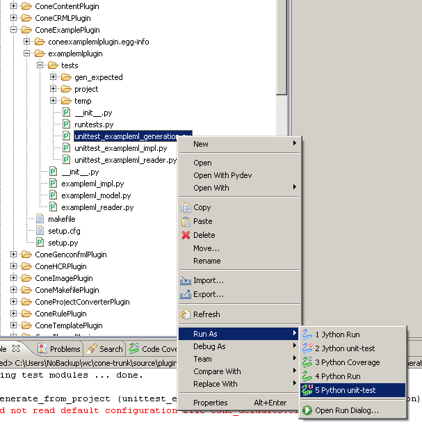

.. _plugin-howto-example-plugin:

Example plug-in
===============

The example plug-in implements a simple Implementation Markup Language that can write
text files with possibly some content coming from ConfML setting values. The plug-in
demonstrates some recommended practices for developing ConE plug-ins:

- Plug-in structure:
    - Reader class
    - Implementation class
    - Implementation model
- Using ``cone.public.utils`` for ConfML setting reference handling
- Unit tests:
    - Testing the reader class, the implementation class and the model classes separately
    - Output generation testing (plug-in scope integration test)

The ExampleML language
----------------------

The Implementation Markup Language in the example plug-in is ExampleML. The language
offers a simple mechanism to write text files to the output directory. For example:

.. code-block :: xml

    <?xml version="1.0" encoding="UTF-8"?>
    <exampleml xmlns="http://www.example.org/xml/exampleml/1">
        <output file="test1.txt" encoding="UTF-8">Test</output>
        <output file="some/dir/test2.txt" encoding="UTF-16">Test</output>
    </exampleml>

To demonstrate the use of ConfML setting references, the language supports also
those with the form ``${Feature.Setting}``. This is the usual way of using them
in implementation languages, and it is recommended to use the same convention
in all ImplMLs. For example:

.. code-block :: xml

    <?xml version="1.0" encoding="UTF-8"?>
    <exampleml xmlns="http://www.example.org/xml/exampleml/1">
        <output file="${SomeFeature.OutputDir}/test2.txt"
                encoding="${SomeFeature.OutputEncoding}">
            Value from ConfML: ${SomeFeature.OutputText}
        </output>
    </exampleml>

.. _plugin-howto-example-plugin-dir-structure:

Directory structure
-------------------

- ``plugins/`` - Root directory for all ConE plug-in sources
    - ``example/`` - Example plug-in package directory
        - ``ConeExamplePlugin/`` - Source for the example plug-in
            - ``examplemlplugin/`` - Module directory containing all plug-in code
                - ``tests/`` - Unit tests and test data for the plug-in
                    - ``project/`` - Configuration project used in the tests
                    - ``gen_expected/`` - Expected output for generation test case
                    - ``__init__.py`` - Test module initialization file
                    - ``runtests.py`` - Script for running all test cases
                    - ``unittest_exampleml_impl.py`` - File containing test cases
                    - ``unittest_exampleml_reader.py`` - File containing test cases
                    - ``unittest_exampleml_generation.py`` - File containing test cases
                - ``__init__.py`` - Plug-in module initialization file
                - ``exampleml_impl.py`` - Plug-in source file
                - ``exampleml_reader.py`` - Plug-in source file
            - ``setup.py`` - Setup script for packaging the plug-in into an .egg file
            - ``setup.cfg`` - Configuration file for ``setup.py``
        - ``integration-test/`` - Integration tests for the example plug-in package
            - ``testdata/`` - Test data for the integration tests
            - ``__init__.py`` - Test module initialization file
            - ``runtests.py`` - Script for running all test cases
            - ``export_standalone.py`` - Script for exporting extra data for standalone test export
            - ``unittest_generate.py`` - File containing test cases

Logical structure
-----------------

Logically the plug-in is divided into three parts:

- *Implementation model*, represents the logical model of the implementation specified in the XML data
- *Implementation class*, works as the interface of the plug-in towards ConE and uses the model to do the actual work
- *Implementation reader*, converts the XML data into the logical model and creates a new implementation class instance

In this case the *model* consists just of the class Output, which corresponds to the ``<output>`` element.

Plug-in code
------------

exampleml_model.py
..................

This file defines the ``Output`` class, which comprises the whole implementation model
in this case. The class contains the same attributes as its XML element counterpart:
file, encoding and text, as well as the methods for generating output from the
``Output`` object.

.. literalinclude:: /../source/plugins/example/ConeExamplePlugin/examplemlplugin/exampleml_model.py
   :linenos:

Notice the use of ``cone.public.utils`` to handle the ConfML settings references. Usage of
setting refs is common enough to warrant a set of functions related to their handling in ``utils``.
It is strongly recommended to use these utility functions instead of creating your own.

.. note::

    The expanding of ConfML setting references is done here, in the ``Output`` object, instead of in the reader
    when the implementation is parsed. If it was done in the parsing phase, ConfML setting values changed
    in rules would not be expanded to their new values.

Another noteworthy thing is that the ``Output`` class implements the methods ``__eq__()``,
``__ne__()`` and ``__repr__()``. These have no real use in the actual implementation, but they
make unit testing easier, as will be seen later on.

The logic for creating the output is here encoded directly in the model, but in cases where
the model is more complex, it may be necessary to create a separate writer class, particularly
if there is more than one output format to be created based on the same model.

exampleml_impl.py
.................

This file defines the implementation class. As can be seen, the class is quite simple, since
it uses the model class to do the actual work and only works as an interface towards ConE.

.. literalinclude:: /../source/plugins/example/ConeExamplePlugin/examplemlplugin/exampleml_impl.py
   :linenos:

exampleml_reader.py
...................

This file defines the reader class. Note how the reading of a single element is given its
own method. Again, this is to make unit testing easier.

.. literalinclude:: /../source/plugins/example/ConeExamplePlugin/examplemlplugin/exampleml_reader.py
   :linenos:

Unit tests
----------

Due to the dynamic nature of Python, an extensive set of unit tests is required for every plug-in.
The unit tests for a ConE plug-in should be in a ``tests`` module (directory) under the plug-in's
main module directory, and contain a set ``unittests_*.py`` files. The naming here is important,
since the ``runtests.py`` file used to run all the unit tests at once collects test cases only
from .py files starting with ``unittest_``.

Unit tests can be executed by running each individual unit test file separately using "Run as" -> "Python unit-test" or
all of the plug-in's unit tests at once by using "Run as" -> "Python run" on ``runtests.py``.

*Running a single unit test file*

It is recommended (well, actually required) to make sure that all unit tests pass before committing changes made to
the code of any plug-in. Also, it should be checked that all of the plug-in's unit tests pass when run as part
of all plug-in unit tests. It is possible that tests that pass when running ``runtests.py`` fail when running them
as part of the whole plug-in test set, as in that case the working directory is not the same. The entire plug-in test
set can be run from ``source/plugins/tests/runtests.py``.

unittest_exampleml_reader.py
............................

This file tests that the reader class functions properly. See how there is a test case for reading
a single ``<output>`` element that tests all the special cases there, and then another that
tests the top-level reader method. Here it becomes obvious why it is worthwhile to implement the
``__eq__()`` etc. methods in model classes, as in the tests we can just give the parser an XML
string and specify exactly what kind of a Python object is expected to be parsed from it.

.. literalinclude:: /../source/plugins/example/ConeExamplePlugin/examplemlplugin/tests/unittest_exampleml_reader.py
   :linenos:

unittest_exampleml_impl.py
..........................

This file tests that the implementation class works as expected. The methods to test are ``has_ref()``
and ``list_output_files()``, since it is vital for the plug-in's correct operation that these methods
do what they are supposed to. Note that ``generate()`` is not tested here, as it is tested in its own
file.

.. literalinclude:: /../source/plugins/example/ConeExamplePlugin/examplemlplugin/tests/unittest_exampleml_impl.py
   :linenos:

unittest_exampleml_generation.py
................................

This file tests that the plug-in works correctly throughout its lifecycle, so it works as an integration test.
Note that plug-in instances are not created manually, but an implementation container is created from the project.
This means that the test also makes sure that the plug-in interoperates correctly with ConE's plug-in machinery.

Also note that the output is checked against an expected set of files using the method ``assert_dir_contents_equal()``,
which comes from a unit test base class defined in a special ``testautomation`` module. This module contains also other
helper methods for use in unit tests, so if you need something more sophisticated than the simple methods provided
by the ``unittest`` module, you should check the ``testautomation`` module before writing the methods yourself.
The module can be found under ``source/``.

Notice also how the generation output directory is set to be in a ``temp/`` directory in the same directory
as the test .py file is. It is recommended to keep all temporary test data in a single place like this, so that
they don't litter e.g. the current working directory. When using a single ``temp/`` directory, it can also be
ignored in version control to avoid unnecessarily listing the temporary data when checking for modification in
the workding copy.

.. literalinclude:: /../source/plugins/example/ConeExamplePlugin/examplemlplugin/tests/unittest_exampleml_generation.py
   :linenos:

Plug-in packaging
-----------------

The file ``setup.py`` handles the packaging of the plug-in into an egg file.

The most important thing here is the plug-in's entry point info. The
plug-in's reader classes must be specified as entry points, or they won't be
loaded.

.. literalinclude:: /../source/plugins/example/ConeExamplePlugin/setup.py
   :linenos:

.. _plugin-howto-example-plugin-integration-tests:

Integration tests
-----------------

In addition to the unit tests inside the plug-in itself there is a separate integration test set.
The purpose of these tests is to make sure that the plug-ins in the package work properly
together with other implementations from the CLI level. E.g. a common case that is good to
test is to check that ConfML settings changed in rules affect the implementations using
references to those settings work properly.

These tests are also exported as part of the standalone test set used to test a pre-built
ConE distribution (see :ref:`installation-export-tests`). This affects the way some things
are handled in the test cases, for example the way the command to run is determined.

The integration test set is plug-in package specific, not plug-in specific, so the test
project(s) used there should contain implementations of all the implementation languages
provided by the plug-ins in the package. Of course, in this case there are only ExampleML
implementations, since the example plug-in is the only plug-in in the example package.

runtests.py
...........

This file simply acts as a shortcut to run all test cases easily.

__init__.py
...........

This file performs all integration test specific initialization using the plug-in utility
functions in the root ``plugins/`` directory. Note that when the integration test set is
exported as standalone, the contents of this file are erased (the integration test
initialization cannot be done there, since the full ConE source is not available). Because
of this, you should not put anything that is always needed in this file.

export_standalone.py
....................

This file contains a function for exporting any needed extra data into the standalone test
set (e.g. something from under the plug-in sources). The file doesn't necessarily need to
exist if there is no extra data in need of exporting, but in this example it exists to show
what could be done in it.

.. literalinclude:: /../source/plugins/example/integration-test/export_standalone.py
   :linenos:

unittest_generate.py
....................

This file contains tests for generating output using the example plug-in.
Note the following things:

- The use of the variable ``CONE_CMD`` in ``get_cmd()``. This variable is set to
  contain the actual ConE command to run if the tests are being run from the
  exported standalone test set. In practice this will be something like
  ``C:/cone_test/cone/cone.cmd``.
- The actual generation and testing is done in a separate function, ``run_test_generate()``,
  and there are two actual test functions that call it. One runs the test directly on the
  test project on the file system, and another first zips the test project and then runs
  the test on that. It is a good idea to test that generation works the same in both cases,
  since it can be easy to forget to take into account generation from a ZIP file when creating
  a plug-in (e.g. using ``shutil`` functions to perform copy operations when the ConE API
  should be used).

.. literalinclude:: /../source/plugins/example/integration-test/unittest_generate.py
   :linenos:
