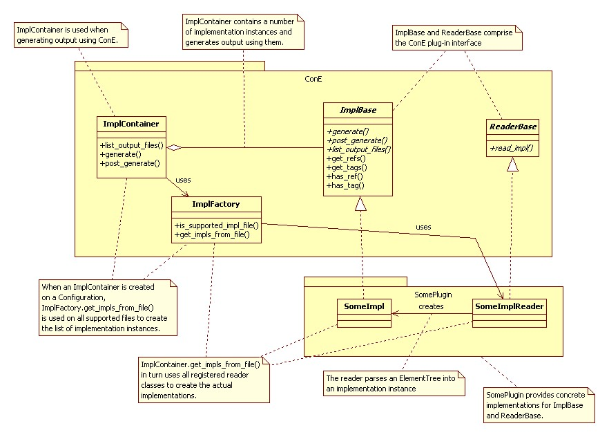
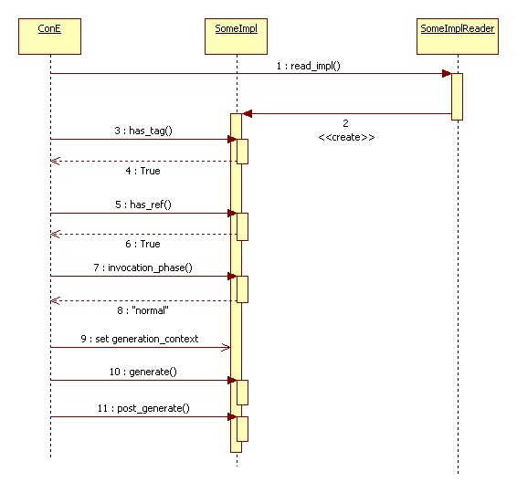
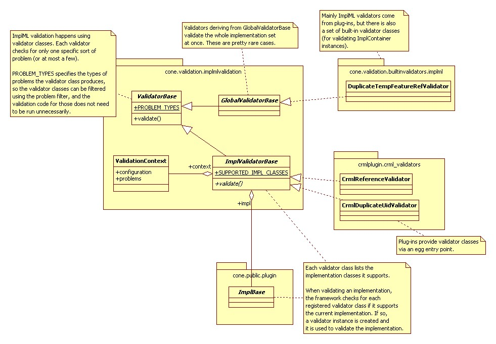
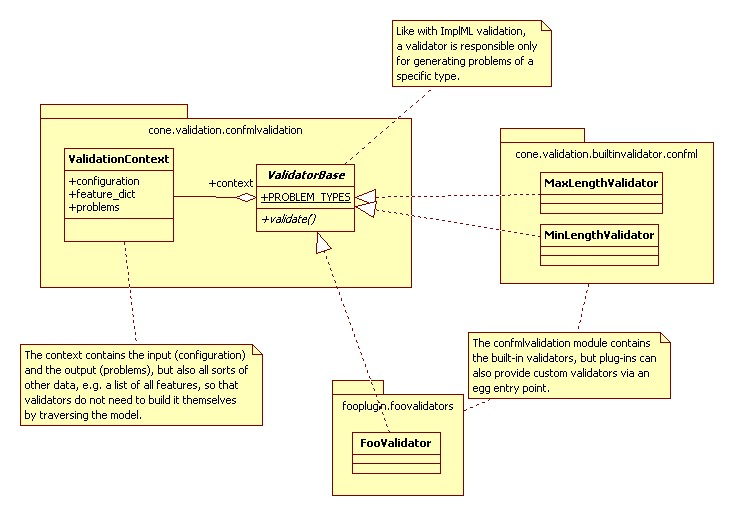

.. _plugin-howto-plugin-interface:

Plug-in interface
=================

Implementation languages
------------------------

A ConE plug-in that adds support for an implementation language has two points
for interfacing with ConE:

#. Reader classes that derive from ``cone.public.plugin.ReaderBase`` . These classes
   define supported Implementation Markup Languages (i.e. supported XML namespaces)
   and other attributes related to them like file extensions. As the name suggests, they are
   also responsible for reading implementation instances from XML data.
#. Implementation classes that derive from ``cone.public.plugin.ImplBase``. These classes
   supply the actual run-time functionality of the plug-ins.

The following UML diagram shows the most important classes and their interdependencies:

For more information on the classes see the
`ConE API epydoc <../../epydoc/cone.public.plugin-module.html>`_.

ConE generation can be seen to consist of two phases, implementation parsing
and output generation:

Parsing phase:

- Implementation file list is filtered based on a user-given file name pattern
  and supported file extensions
- All remaining files are parsed into ``ElementTree`` instances
- The ``ElementTree`` instance is scanned for supported ImplML namespaces and
  implementation instances are created using the correct reader classes
  (the ``read_impl()`` method)
- All implementations are collected into an ``ImplSet`` instance

Generation phase:

- Implementation instances are further filtered using tags and ConfML references
  (the ``has_tag()`` and ``has_ref()`` methods)
- Implementations instances are divided into separate sets based on their invocation
  phases
- Output is generated using each implementation set. For each implementation set:

    - The ``generation_context`` variable of each implementation instance is set
      (this context contains generation-scope information implementation instances may use)
    - The ``generate()`` method of each instance is called
    - The ``post_generate()`` method of each instance is called

From a plug-in's point of view, the sequence of method calls goes as follows:

Explanations of the steps in the diagram:

====== ========================================================================
Step   Explanation
====== ========================================================================
1      ``read_impl()`` is called to create an implementation instance based on
       XML data.
2      ``read_impl()`` creates the instance.
3-6    Filtering based on ConfML references and implementation tags is done.
       The implementation instance returns True in all cases, so it is included
       in the actual generation.
7-8    The instance is asked for its invocation phase (here it returns "normal")
9      The implementation instance's ``generation_context`` variable is set, so
       then it can be used in the actual generation.
10-11  Output generation methods are called
====== ========================================================================

.. _plugin-howto-plugin-interface-validation:

Validation
----------

.. note::
    
    See also :ref:`validation-overview`

The ConE plug-in interface allows for the extension of ConfML and ImplML validation.
In the same way as support for new implementation languages can be provided
by exposing implementation reader classes via egg entry points, validation
can be extended by exposing validator classes.

Validation happens roughly in the following manner:

1. A list of *validator classes* is obtained through some means. In practice
   this usually means finding all validator classes, and then filtering them
   down to those that produce the problems that we are interested in.
2. A *validation context* is created. This contains everything associated with
   the validation, and here all found problems are reported. All validators
   have access to it.
3. For each entity (configuration or implementation instance) that is being
   validated, an instance of each validator class is created and invoked.

This process is nearly the same for ConfML and ImplML validation, only some
details about the validation context and the entities being validated are
different, as well as the fact ConfML validation on the entire configuration,
whereas ImplML validation happens on individual implementation instances, with
a few exceptions.

The following diagram illustrates ImplML validation:

The following diagram illustrates ConfML validation:

For more information on the classes involved in validate see the
ConE API epydoc for `cone.validation.implmlvalidation <../../epydoc/cone.validation.implmlvalidation-module.html>`_
and `cone.validation.confmlvalidation <../../epydoc/cone.validation.confmlvalidation-module.html>`_.
Also the built-in validators in the package `cone.validation.builtinvalidators <../../epydoc/cone.validation.builtinvalidators-module.html>`_
can serve as examples.