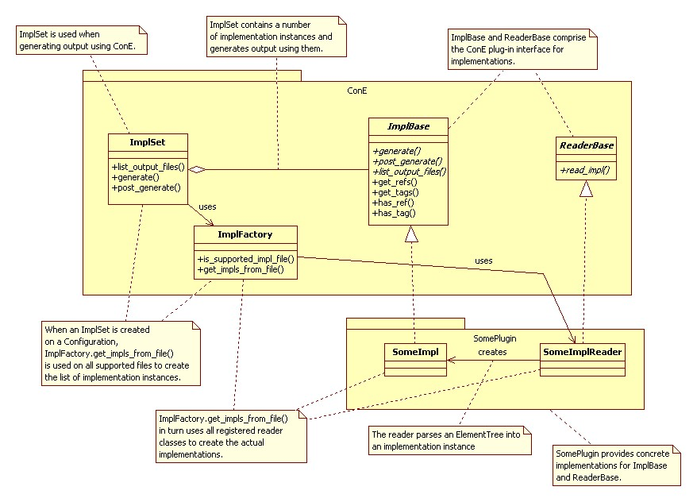

.. _plugin-howto-plugin-interface:

Plug-in interface
=================

A ConE plug-in has two points for interfacing with ConE:

#. Reader classes that derive from ``cone.public.plugin.ReaderBase`` . These classes
   define supported Implementation Markup Languages (i.e. supported XML namespaces)
   and other attributes related to them like file extensions. As the name suggests, they are
   also responsible for reading implementation instances from XML data.
#. Implementation classes that derive from ``cone.public.plugin.ImplBase``. These classes
   supply the actual run-time functionality of the plug-ins.

The following UML diagram shows the most important classes and their interdependencies:

ConE generation can be seen to consist of two phases, implementation parsing
and output generation:

Parsing phase:

- Implementation file list is filtered based on a user-given file name pattern
  and supported file extensions
- All remaining files are parsed into ``ElementTree`` instances
- The ``ElementTree`` instance is scanned for supported ImplML namespaces and
  implementation instances are created using the correct reader classes
  (the ``read_impl()`` method)
- All implementations are collected into an ``ImplSet`` instance

Generation phase:

- Implementation instances are further filtered using tags and ConfML references
  (the ``has_tag()`` and ``has_ref()`` methods)
- Implementations instances are divided into separate sets based on their invocation
  phases
- Output is generated using each implementation set. For each implementation set:

    - The ``generation_context`` variable of each implementation instance is set
      (this context contains generation-scope information implementations instances may use)
    - The ``generate()`` method of each instance is called
    - The ``post_generate()`` method of each instance is called

From a plug-in's point of view, the sequence of method calls goes as follows:

.. image:: plugin_lifecycle.jpg

Explanations of the steps in the diagram:

====== ========================================================================
Step   Explanation
====== ========================================================================
1      ``read_impl()`` is called to create an implementation instance based on
       XML data.
2      ``read_impl()`` creates the instance.
3-6    Filtering based on ConfML references and implementation tags is done.
       The implementation instance returns True in all cases, so it is included
       in the actual generation.
7-8    The instance is asked for its invocation phase (here it returns "normal")
9      The implementation instance's ``generation_context`` variable is set, so
       then it can be used in the actual generation.
10-11  Output generation methods are called
====== ========================================================================

Plug-in interface class source
------------------------------

The following source listings show the most important parts of the ``ImplReader``
and ``ImplBase`` classes from a plug-in's point of view:

.. code-block:: python

    class ReaderBase(object):
        """
        Base class for implementation readers.
        
        Each reader class supports one XML namespace, from which it reads an implementation
        instance.
        
        The method for parsing an implementation (read_impl()) is given an ElementTree
        XML element as the root from which to parse the implementation. The plug-in
        machinery handles each XML file so that the correct reader class is used to read
        the implementations from XML elements based on the namespaces.
        """
        
        # The XML namespace supported by the implementation reader.
        # Should be something like "http://www.xyz.org/xml/1".
        # Can also be None, in which case the reader will not be used
        # (this can be useful for defining base classes for e.g. readers
        # for different versions of an implementation).
        NAMESPACE = None
        
        # Any extra XML namespaces that should be ignored by the
        # implementation parsing machinery. This is useful for specifying
        # namespaces that are not actual ImplML namespaces, but are used
        # inside an implementation (e.g. XInclude)
        IGNORED_NAMESPACES = []
        
        # Supported implementation file extensions.
        # Sub-classes can override this to add new supported file extensions
        # if necessary. The file extensions simply control whether implementations
        # are attempted to be read from a file or not.
        # Note that the extensions are case-insensitive.
        FILE_EXTENSIONS = ['implml']
        
        @classmethod
        def read_impl(cls, resource_ref, configuration, doc_root):
            """
            Read an implementation instance from the given element tree.
            
            @param resource_ref: Reference to the resource in the configuration in
                which the given document root resides.
            @param configuration: The configuration used.
            @param doc_root: The document root from which to parse the implementation.
            @return: The read implementation instance, or None.
            """
            raise exceptions.NotSupportedException()

.. code-block:: python

    class GenerationContext(object):
        """
        Context object that can be used for passing generation-scope
        data to implementation instances.
        """
        
        def __init__(self, tags={}):
            # The tags used in this generation context
            # (i.e. the tags passed from command line)
            self.tags = tags
            
            # A dictionary that implementation instances can use to
            # pass any data between each other
            self.impl_data_dict = {}

.. code-block:: python

    class ImplBase(object):
        """
        Base class for any confml implementation. 
        """
        
        # Identifier for the implementation type, used e.g. in .cfg files.
        # Should be a string like e.g. 'someml'.
        IMPL_TYPE_ID = None
        
        # Defines the default invocation phase for the implementation.
        # The default is used if the phase is not explicitly set in the
        # ImplML file or manually overridden by calling set_invocation_phase()
        DEFAULT_INVOCATION_PHASE = None
        
        def __init__(self,ref, configuration):
            """
            Create a ImplBase object
            @param ref : the ref to the Implml file resource.
            @param configuration : the Configuration instance for the
            configuration data.
            """
            self._settings = None
            self.ref = ref
            self.index = None
            self.configuration = configuration
            self.output_root = self.settings.get('output_root','output')
            self.output_subdir = self.settings.get('output_subdir','')
            self.plugin_output = self.settings.get('plugin_output','')
            
            self.generation_context = None
            self._tags = None
            self._invocation_phase = None
            self._tempvar_defs = []

        def generate(self):
            """
            Generate the given implementation.
            @return: 
            """
            raise exceptions.NotSupportedException()
        
        def post_generate(self):
            """
            Called when all normal generation has been done.
            
            @attention: This is a temporary method used for implementing cenrep_rfs.txt generation.
            """
            pass
        
        def list_output_files(self):
            """
            Return a list of output files as an array. 
            """
            raise exceptions.NotSupportedException()
        
        def get_refs(self):
            """
            Return a list of all ConfML setting references that affect this
            implementation. May also return None if references are not relevant
            for the implementation.
            """
            return None
