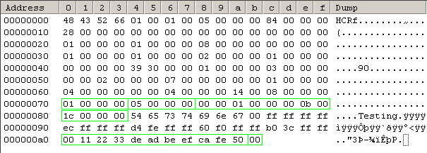

User guide for HCR Plugin usage in ConE
=======================================

Introduction
------------
This page describes how to use ConE HCR plug-in (for Hardware configuration repository).
The plug-in defines the HCRML Implementation Markup Language, whose purpose is to provide
the means for creating bindings between ConfML settings and Hardware Configuration Repository
keys, and generating hcr.dat and C++ header files based on these bindings.

XML namespace and file extension
--------------------------------

- Namespace: ``http://www.symbianfoundation.org/xml/hcrml/1``
- File extension: ``hcrml``

HCRML elements
--------------

The HCRML model is drawn out as a UML model in below picture.

  .. image:: hcrml_elements.jpg

category
^^^^^^^^

The category represents the same concept as a category in the HCR specification, which must have a name and UID. 
The category element can exist directly under the HCRML root element or an output element.

**Attributes**

  * *name* - C++ variable name for the category UID in the generated header file
  * *uid* - UID of the category, must be unique in the repository

**Example**

.. code-block:: xml

  <category name="KCatGPIO" uid="0x10001234">

setting
^^^^^^^

The setting is a sub element of category, it can only exist inside a category. The setting can have the following 
attributes:

**Attributes**

  * *name* - C++ variable name for the setting UID in the generated header file
  * *id* - UID of the setting, must be unique under a certain category
  * *type* - Type of the setting (can be one of setting value types, see next section)
  * *comment* - Single-line comment for the setting (visible in the generated header file)

**Setting value type definitions**

The HCRML value type definitions are derived from repository definitions. So the value type is the 
same in HCRML, where the prefix EType has been removed and the entry is in lower case.

        ==============  ==============
        HCRML type      HCR type 
        ==============  ==============
        int32           ETypeInt32
        int16           ETypeInt16
        int8            ETypeInt8
        bool            ETypeBool
        uint32          ETypeUInt32
        uint16          ETypeUInt16
        uint8           ETypeUInt8
        linaddr         ETypeLinAddr
        bindata         ETypeBinData
        text8           ETypeText8
        arrayint32      ETypeArrayInt32   
        arrayuint32     ETypeArrayUInt32
        int64           ETypeInt64
        uint64          ETypeUInt64  
        ==============  ==============

Note:
Data for the type ``text8`` is encoded in UTF-8. This means that pure ASCII text will work
correctly without any further processing, and if any characters outside the ASCII range
are expected to be in the text, the C++ implementation will need to take the encoding into
account.

**Supported ConfML setting types for HCRML types**

+------------------+------------------------------------------------------------------+
| HCRML type       | ConfML setting type                                              |
+==================+==================================================================+
| int8, int16,     | int                                                              |
| int32, int64,    |                                                                  |
| uint8, uint16,   |                                                                  |
| uint32, uint64,  |                                                                  |
| linaddr          |                                                                  |
+------------------+------------------------------------------------------------------+
| bool             | boolean, int                                                     |
+------------------+------------------------------------------------------------------+
| arrayint32,      | Sequence with an int sub-setting                                 |
| arrayuint32      |                                                                  |
+------------------+------------------------------------------------------------------+
| text8            | string                                                           |
+------------------+------------------------------------------------------------------+
| bindata          | string with a hexadecimal value, whitespace ignored              |
|                  | (e.g. ``ABCDEF 1234 5678``)                                      |
+------------------+------------------------------------------------------------------+

**Examples**

.. code-block:: xml

  <setting ref="hcrexample.DebounceInterval" name="KElmGPIO_DebounceInterval" type="int32" id="0"/>
  <setting ref="hcrexample.GPIO_1" name="KElmGPIO_1" type="int32" id="1" comment="Pin1"/>
  <setting ref="hcrexample.GPIO_2" name="KElmGPIO_2" type="int32" id="2" comment="Pin2"/>

flags
^^^^^

Flags element is a subelement of setting that can be used to define bit flags to a setting. 

**Attributes**

Each flag attribute can have values 0,1, default value is 0.

  * *uninitialised*
  * *modifiable*
  * *persistent*
  

**Examples**

.. code-block:: xml

  <flags uninitialized="0"/>
  <flags modifiable="1" persistent="1"/>

output
^^^^^^

Output element is a subelement of the root HCRML element used define output file generation. The output element 
should include a set of category and setting definitions that are included in the output file. The output section can 
also include other HCRML files to include category/setting definitions to it. 

If the included HCRML files contain output sections of their own, the generation is supposed the generate 
only the topmost output element. So any included output element is simply ignored.

**Attributes**

  * *file* - The output filename to be generated)
  * *type* - The output file type, which can be one of [header|hcr]
  * *version* - For hcr.dat, the HCR version number
  * *readonly* - For hcr.dat, the read-only bit
  

**Examples**

.. code-block:: xml

  <output file="test.h" type="header">
  </output>
  <output file="HCR.DAT" type="hcr" version="1">
  </output>

include
^^^^^^^
Include element can be used to include content of other HCRML files. The purpose is mainly to allow
inclusion of categories and settings inside the output section. It allows wildcards to enable inclusion of
multiple HCRML files with single line, or the inclusion of all existing HCRML files.

**Attributes**

  * *ref* - The pattern for including files

**Examples**

.. code-block:: xml
  
  <include ref="foo.hcrml">
  <include ref="bar.hcrml">
  <include ref="my*.hcrml">

Creating an HCRML configuration file
------------------------------------

The HCRML format is designed for two purposes. To allow definition of components specific binding 
between confml settings and Hardware configuration repository keys  and to create/generate a C++ type 
header file from HCR key definition file. Secondly to allow creation/generation of Hardware 
configuration repository output file from multiple developer/component specific HCRML files.

The normal lifecycle of these implementation files is described in below.
 
  1. Create/define the components configuration interface with confml
  2. Create/define the needed hcr keys and the binding between confml features.
  3. Generate the C++ header for the component from the configuration project
    
    * e.g. ``cone generate`` (in the conf folder)
    
  4. Export/merge the component configuration as part of global configuration 
    
    * e.g.  ``cone merge -r . -p /epoc32/rom/config_project/hcr`` (in the conf folder)
 
  .. image:: hcrml_developer_project.png

  5. Define hcrml for hcr.dat generation. (Should be eventually in the same hcr layer inside the configuration project)
  6. Generate the HCR.DAT
    
    * e.g.  ``cone generate -p /epoc32/rom/config_project/hcr``

  .. image:: hcrml_global_project.png

Examples
--------

**HCRML file example**

.. code-block:: xml

    <?xml version="1.0" encoding="UTF-8"?>
    <hcr xmlns="http://www.symbianfoundation.org/xml/hcrml/1">
    <output file="example.h" type="header">
      <category name="KCatGPIO" uid="0x10001234">
        <setting ref="hcrexample.DebounceInterval" name="KElmGPIO_DebounceInterval" type="int32" id="0"/>
        <setting ref="hcrexample.GPIO_1" name="KElmGPIO_1" type="int32" id="1" comment="Pin1"/>
        <setting ref="hcrexample.GPIO_2" name="KElmGPIO_2" type="int32" id="2" comment="Pin2"/>
      </category>
    </output>
    </hcr>

**Explanation**

The above HCRML file defines three settings's under category KCatGPIO, which has the UID 0x10001234. Each 
setting must have a unique ID inside the category. And each setting must define ref that points to a confml 
setting. The data value of that particular key is fetched from that confml reference. The name element
in the category and settings can be used to generate the C header file from the HCRML.

A output element encapsulates the setting definitions in this file. It is not necessary, but it enables
that example.h header file can be generated from this component specific HCRML file. 

**HCR repository file example**

.. code-block:: xml

    <?xml version="1.0" encoding="UTF-8"?>
    <hcr xmlns="http://www.symbianfoundation.org/xml/hcrml/1">
      <output file="HCR.DAT" type="hcr" version="1" readOnly="1">
        <include ref="*.hcrml">
      </output>
    </hcr>

**Explanation**

The above HCRML entry would define a HCR binary output file HCR.DAT with version 1 and readonly bit true. 
The file generation will try to include all .hcrml ending files from the configuration project. 
The include statement will just look for any matching file and include its content inside this file. If the 
included hcrml files include an output section, they are simple ingored and only the topmost output 
file will be generated.

The output file section will in the end contain all categories and keys of all HCRML files. 
These files would normally be the files which are exported to the configuration project from several 
component configurations.

Downloadable example
--------------------

Download: :download:`hcrml_example.zip`

This example contains a mock developer project like shown earlier. It has
a ``conf/`` directory containing the ConfML and HCRML files, and (empty) ``inc/``,
``src/`` and ``group/`` directories. The important part is the ``conf/`` directory, which
contains the following files:

- ``confml/hcr_component1.confml`` - ConfML interface for the HCR settings
- ``implml/component1.hcrml`` - HCRML file defining the binding between the ConfML settings and the HCR settings
- ``implml/hcr_dat.hcrml`` - HCRML file for generating ``hcr.dat``
- ``implml/hcr_keys.hcrml`` - HCRML file for generating ``hcr_keys.h``
- ``root.confml`` - Needed for generation to work; contains a link to ``confml/hcr_component1.confml``

To generate, cd to ``component1/conf/`` and run::

  cone generate

This will generate an ``output/`` directory with the files ``hcr.dat`` and ``hcr_keys.h``.

Linking between ConfML/HCRML/output
^^^^^^^^^^^^^^^^^^^^^^^^^^^^^^^^^^^

Here the linking between ConfML/HCRML/output is shown using the binary data
setting. Irrelevant parts of the files are omitted for clarity.

**ConfML:**

.. code-block:: xml

    <feature ref="HcrComponent1" name="HCR test component 1">
        ...
        <setting ref="BinDataSetting" name="Binary data setting" type="string"/>
        ...
    </feature>
    ...
    <data>
        <HcrComponent1>
            ...
            <BinDataSetting>00112233 DEADBEEF CAFE 50</BinDataSetting>
            ...
        </HcrComponent1>
    </data>

**HCRML:**

.. code-block:: xml

    <category name="KHcrComponent1" uid="0x00000001">
        ...
        <setting ref="HcrComponent1.BinDataSetting" name="KBinDataSetting" type="bindata" id="5" comment="Binary data setting"/>
        ...
    </category>

**Output - hcr.dat:**

**Output - hcr_keys.h:**

.. code-block:: c++

    #ifndef HCR_KEYS_H
    #define HCR_KEYS_H

    #include <hcr.h>

    const HCR::TCategoryUid KHcrComponent1 = 0x00000001;

    ...
    
    // Binary data setting
    const HCR::TElementId KBinDataSetting    = 0x00000005;

    #endif

XSD
---

Download: :download:`hcrml.xsd </xsd/hcrml.xsd>`

FAQ
---

This will be updated based on the questions.

